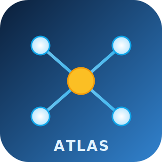
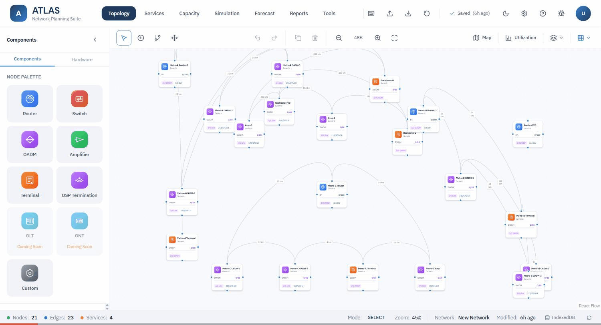
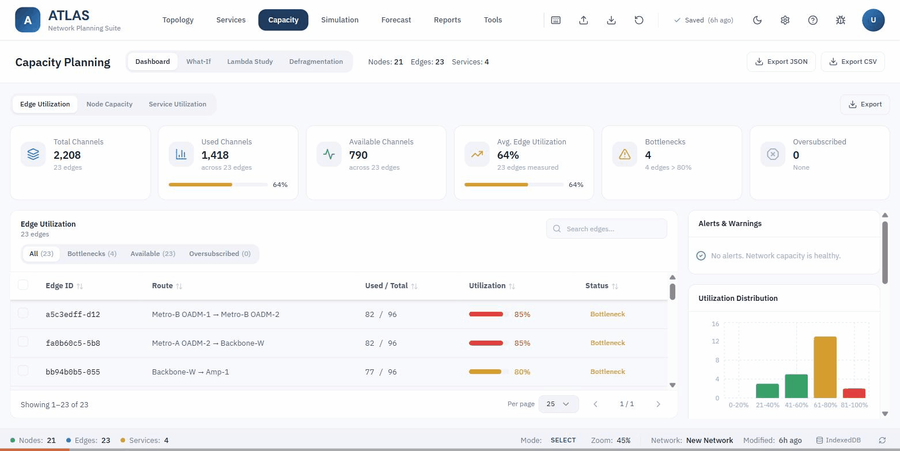
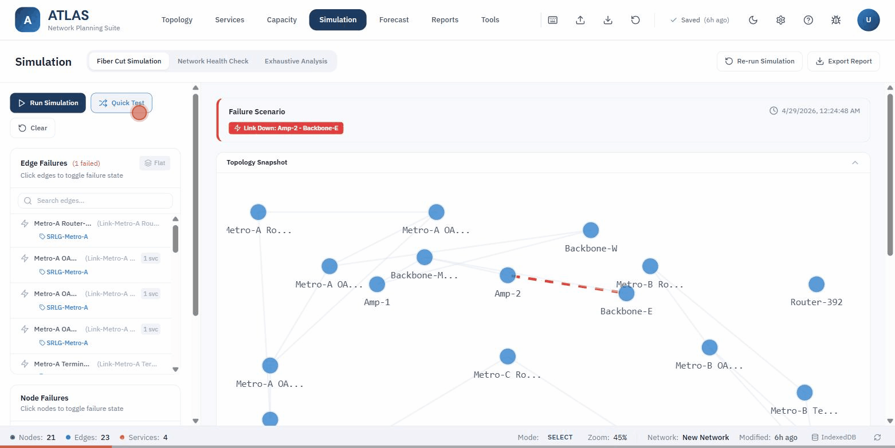

<p align="center">
  
</p>

<h1 align="center">ATLAS — Network Planning &amp; Design Tool</h1>

<p align="center">
  A vendor-agnostic, browser-based suite for designing, simulating, and validating optical &amp; IP networks. Runs 100% locally — no servers, no telemetry, your topology never leaves your machine.
</p>

<p align="center">
  <a href="LICENSE"></a>
  
  
  
  
  
  <a href="https://github.com/dicesoft/Network-Planning-and-Design-Tool/stargazers"></a>
</p>

<p align="center">
  
</p>

---

## Table of Contents

- [Why ATLAS](#why-atlas)
- [Highlights](#highlights)
- [Quick Start](#quick-start)
- [Features in Motion](#features-in-motion)
- [Tech Stack](#tech-stack)
- [Project Structure](#project-structure)
- [Scripts](#scripts)
- [Deployment](#deployment)
- [Documentation](#documentation)
- [Contributing](#contributing)
- [License](#license)

## Why ATLAS

Carrier-grade planning tools are heavyweight, vendor-locked, and either cloud-bound or seven figures. ATLAS is the opposite: a **single static bundle** you open in a browser, with first-class support for DWDM optical engineering (OSNR, channels, ROADM/OADM, amplifiers), L1/L2/L3 services, capacity what-if analysis, and exhaustive failure simulation. State persists locally via IndexedDB; nothing is uploaded.

If you've ever wanted the parts of Huawei NCE / Nokia NSP / Cisco NSO that matter for *design* — without their licensing or footprint — that's the brief.

## Highlights

- **Schematic + Geographic dual view** — React Flow canvas and a Leaflet map render the same topology.
- **DWDM-aware** — ITU-T G.694.1 channel allocation (100 / 50 GHz fixed and flex-grid), span-by-span OSNR with the GN model, EDFA insertion, ROADM/OADM, and per-fiber profiles (G.652.D, G.654.E, G.655, G.657.A1).
- **L1 / L2 / L3 services** — wavelength services, Ethernet over L1, IP over L1, with 1+1 / OLP / SNCP / WSON protection and SRLG diversity scoring.
- **Capacity intelligence** — utilization dashboard, bottleneck/oversubscription detection, what-if path computation, lambda availability study, and a five-step defragmentation wizard with two-phase commit.
- **Failure simulation** — single-link, single-node, exhaustive multi-failure (50K cap), one-click *Network Health Check* with SPOF surfacing.
- **Modular &amp; moddable** — JSON config for transceivers, cards, fiber profiles, optical defaults; everything import/exportable.
- **Reliable persistence** — IndexedDB primary with localStorage fallback, JSON-Patch undo/redo (50-state history with keyframes), cross-tab sync via BroadcastChannel.
- **Vendor importers** — placeholders for Huawei NCE, Nokia NSP, Cisco, Ciena, Juniper.
- **No telemetry, no backend, no account.** Open `index.html` and you're working.

## Quick Start

```bash
git clone https://github.com/dicesoft/Network-Planning-and-Design-Tool.git
cd Network-Planning-and-Design-Tool
npm install
npm run dev          # http://localhost:3000
```

Build a static production bundle:

```bash
npm run build        # → ./dist  (single drop-in folder)
```

That's it — `dist/` is the entire application.

## Features in Motion

### Service Wizard — L1 / L2 / L3 in five steps

<p align="center">
  
</p>

Pick a service type, source &amp; destination, parameters, working/protection paths, then review. The wizard validates channel availability, computes shortest / k-shortest / disjoint paths, and surfaces SRLG conflicts before you commit.

### Capacity Planning — dashboard, what-if, lambda, defrag

<p align="center">
  
</p>

Live edge utilization, bottleneck and oversubscription detection, distribution histograms, alerts panel. The What-If tab simulates new services without committing; Lambda Study scans wavelength availability per path; Defragmentation proposes channel re-arrangement with two-phase commit (preview → simulate → apply).

### Failure Simulation &amp; Health Check

<p align="center">
  
</p>

Toggle edges or nodes to fail, then run. Quick Test fires a random failure for a sanity check. Network Health Check sweeps every edge and node to produce a 0–100 score with SPOF list. Exhaustive Analysis tests every combination up to N concurrent failures (capped at 50K scenarios) and ranks worst-case impact.

## Tech Stack

| Layer | Choice |
|---|---|
| Framework | React 18 + TypeScript 5.3 |
| Build | Vite 5 |
| State | Zustand 4 (immer + persist) |
| Graph rendering | React Flow (`@xyflow/react`) |
| Graph algorithms | Graphology + custom Dijkstra / Yen's / disjoint-path engine |
| Map | Leaflet + react-leaflet (CartoDB tiles) |
| UI primitives | Radix UI (shadcn/ui pattern) |
| Styling | Tailwind CSS |
| Storage | IndexedDB (`idb-keyval`) with localStorage fallback |
| History | `fast-json-patch` (keyframe every 10th entry) |
| Tests | Vitest + Testing Library + Puppeteer |

## Project Structure

```
src/
├── components/
│   ├── topology/        Canvas, NetworkNode, edge & inspectors
│   ├── services/        Service table, modal, wizard, badges
│   ├── capacity/        Dashboard, What-If, Lambda Study, Defrag wizard
│   ├── simulation/      Fiber cut, Network Health Check, Exhaustive
│   ├── reports/         Report shell, exporters, summary
│   ├── settings/        Pending-state settings dialog
│   ├── layout/          Header, Sidebar, StatusBar, HardwarePanel
│   └── ui/              Radix-based primitives (Button, Dialog, …)
├── core/
│   ├── graph/           GraphEngine, PathFinder algorithms
│   ├── optical/         OSNREngine (GN model, span-by-span)
│   ├── services/        L1/L2L3 managers, ChannelChecker, SRLG, defrag
│   ├── simulation/      FailureSimulator, ExhaustiveSimulator
│   ├── spectrum/        ITU-T G.694.1 channel configuration
│   ├── analysis/        Health score
│   └── validation/      Port, fiber, OSP, channel, service
├── stores/              Zustand stores: network, ui, service, simulation, settings, theme, event
├── lib/                 Shortcut dispatcher, storage migration, utilities
├── pages/               Capacity, Simulation, Services, Reports, Tools
└── types/               network, ui, service, simulation, reports, settings
```

## Scripts

| Command | Purpose |
|---|---|
| `npm run dev` | Vite dev server on port 3000 |
| `npm run build` | tsc + vite build → `dist/` |
| `npm run preview` | Serve the production bundle locally |
| `npm run test` | Vitest watch mode |
| `npm run test:run` | Vitest single pass |
| `npm run test:coverage` | Vitest with v8 coverage |
| `npm run test:e2e` | Puppeteer end-to-end suite |
| `npm run test:bundle` | Reject `console.log` / `debugger` in `dist` |
| `npm run lint` | ESLint (warnings allowed) |
| `npm run lint:strict` | ESLint, zero warnings |

## Deployment

Four supported targets, all from the same source — no forks:

- **Static** — `npm run build` and host `dist/` anywhere (S3, GitHub Pages, file://).
- **Docker** — `docker-compose --profile prod up --build` (nginx).
- **Dev container** — `docker-compose --profile dev up` (hot reload).
- **Google Cloud Run** — `Dockerfile.cloudrun` + see [`docs/DEPLOYMENT-CLOUD-RUN.md`](./docs/DEPLOYMENT-CLOUD-RUN.md).

The bundle is held under **2.1 MB**.

## Documentation

- [`docs/DOCUMENTATION.md`](./docs/DOCUMENTATION.md) — technical reference
- [`docs/DWDM-Knowledge-Base-v2.md`](./docs/DWDM-Knowledge-Base-v2.md) — optical engineering background
- [`docs/E2E-TESTING-GUIDE.md`](./docs/E2E-TESTING-GUIDE.md) — Puppeteer test conventions
- [`docs/Roadmap.md`](./docs/Roadmap.md) — what's next

## Contributing

Pull requests welcome. See [`CONTRIBUTING.md`](./CONTRIBUTING.md) for the workflow, branch policy, and quality gates.

## License

[MIT](./LICENSE) © 2026 dicesoft
