# Technical Documentation

This document provides detailed technical documentation for the Network Planning & Design Tool.

## Table of Contents

- [Architecture Overview](#architecture-overview)
- [State Management](#state-management)
- [Theme System](#theme-system)
- [Geographic View](#geographic-view)
- [Location Picker](#location-picker)
- [Grid Controls](#grid-controls)
- [Delete Confirmation](#delete-confirmation)
- [Node Icons](#node-icons)
- [In-App Help (WikiModal)](#in-app-help-wikimodal)
- [Multi-Element Selection](#multi-element-selection)
- [Port Configuration System](#port-configuration-system)
- [OSP Termination Nodes](#osp-termination-nodes)
- [Node Location Metadata](#node-location-metadata)
- [Fiber Parameter Profiles](#fiber-parameter-profiles)
- [DWDM Channel/Lambda Spectrum Management](#dwdm-channellambda-spectrum-management)
- [Service Management](#service-management)
- [Smart Edge Rendering](#smart-edge-rendering)
- [Cross-Tab Synchronization](#cross-tab-synchronization)
- [Event Logging System](#event-logging-system)
- [Graph Algorithms](#graph-algorithms)
- [Path-Finding Constraints](#path-finding-constraints)
- [Algorithm Benchmarking](#algorithm-benchmarking)
- [Component Architecture](#component-architecture)
- [UX Enhancements](#ux-enhancements)
- [Code Quality](#code-quality)
- [Testing Strategy](#testing-strategy)
- [Export/Import System](#exportimport-system)
- [Data Persistence](#data-persistence)
- [Deployment](#deployment)
- [Capacity Planning](#capacity-planning)
- [Simulation](#simulation)
- [Network Reports](#network-reports)
- [CSV Utilities](#csv-utilities)
- [OSNR Engine](#osnr-engine)
- [Transceiver Library](#transceiver-library)
- [Inventory System](#inventory-system)
- [WSON Simulation](#wson-simulation)
- [IndexedDB Storage](#indexeddb-storage)
- [Settings Dialog](#settings-dialog)
- [Inventory Management](#inventory-management-settings)
- [NCE Import Engine](#nce-import-engine)
- [Capacity Forecasting](#capacity-forecasting)

---

## Architecture Overview

The application follows a modular architecture with clear separation of concerns:

```
┌─────────────────────────────────────────────────────────────┐
│                     React Components                        │
│  ┌─────────┐  ┌─────────┐  ┌─────────┐  ┌─────────┐       │
│  │ Canvas  │  │Inspector│  │ Toolbar │  │ Sidebar │       │
│  └────┬────┘  └────┬────┘  └────┬────┘  └────┬────┘       │
│       │            │            │            │             │
│       └────────────┴────────────┴────────────┘             │
│                          │                                  │
│                    ┌─────┴─────┐                           │
│                    │  Zustand  │                           │
│                    │  Stores   │                           │
│                    └─────┬─────┘                           │
│                          │                                  │
│         ┌────────────────┼────────────────┐                │
│    ┌────┴────┐     ┌─────┴────┐    ┌──────┴─────┐         │
│    │ network │     │    ui    │    │   event    │         │
│    │  Store  │     │  Store   │    │   Store    │         │
│    └────┬────┘     └──────────┘    └──────┬─────┘         │
│         │                                  │               │
│         └───────────┬──────────────────────┘               │
│                     │                                       │
│         ┌───────────┴───────────┐                          │
│    ┌────┴─────┐          ┌──────┴──────┐                   │
│    │ IndexedDB │          │ localStorage │                   │
│    │ (primary) │          │  (fallback)  │                   │
│    └───────────┘          └─────────────┘                   │
│         └───────────┬───────────┘                          │
│              ┌──────┴────────────┐                          │
│              │ BroadcastChannel  │                          │
│              │  (cross-tab sync) │                          │
│              └───────────────────┘                          │
└─────────────────────────────────────────────────────────────┘
```

### Key Design Decisions

1. **Zustand over Redux** - Simpler API, less boilerplate, built-in middleware support
2. **Immer integration** - Enables mutable-style updates while maintaining immutability
3. **IndexedDB persistence** - Primary storage via `idb-keyval`, with localStorage fallback
4. **Cross-tab sync** - BroadcastChannel API for reliable multi-tab synchronization

---

## State Management

### Store Architecture

The application uses three Zustand stores:

#### networkStore (`src/stores/networkStore.ts`)

Manages the network topology state:

```typescript
interface NetworkState {
  topology: NetworkTopology;      // Nodes and edges
  selectedNodeIds: string[];      // Current selection
  selectedEdgeIds: string[];
  history: NetworkTopology[];     // Undo/redo history
  historyIndex: number;
}
```

**Key Actions:**
- `addNode()`, `updateNode()`, `removeNode()`, `moveNode()`
- `addEdge()`, `updateEdge()`, `removeEdge()`
- `selectNodes()`, `selectEdges()`, `selectElements()`, `clearSelection()`
- `undo()`, `redo()`, `saveToHistory()`
- `loadTopology()`, `clearTopology()`

#### uiStore (`src/stores/uiStore.ts`)

Manages UI state (tool mode, viewport, modals):

```typescript
interface UIState {
  toolMode: 'select' | 'pan' | 'addNode' | 'addEdge';
  zoom: number;
  viewport: { x: number; y: number };
  inspector: { type: string; targetId: string | null };
}
```

#### eventStore (`src/stores/eventStore.ts`)

Captures application events for logging/debugging:

```typescript
interface EventLogEntry {
  id: number;
  timestamp: string;
  type: 'network' | 'ui' | 'algorithm' | 'system';
  category: string;
  message: string;
  details?: Record<string, unknown>;
}
```

### Middleware Stack

Each store uses the following middleware (applied inside-out):

```typescript
create<State>()(
  devtools(           // Redux DevTools integration
    persist(          // localStorage persistence
      immer(          // Immutable updates with mutable syntax
        (set, get) => ({ ... })
      ),
      { name: 'storage-key' }
    ),
    { name: 'StoreName' }
  )
)
```

---

## Theme System

The application supports light, dark, and system theme modes with automatic preference detection.

### Theme Store (`src/stores/themeStore.ts`)

```typescript
type ThemeMode = 'light' | 'dark' | 'system';
type ResolvedTheme = 'light' | 'dark';

interface ThemeState {
  mode: ThemeMode;           // User preference
  resolvedTheme: ResolvedTheme;  // Actual displayed theme
  setMode: (mode: ThemeMode) => void;
  toggleTheme: () => void;
}
```

### Theme Resolution Flow

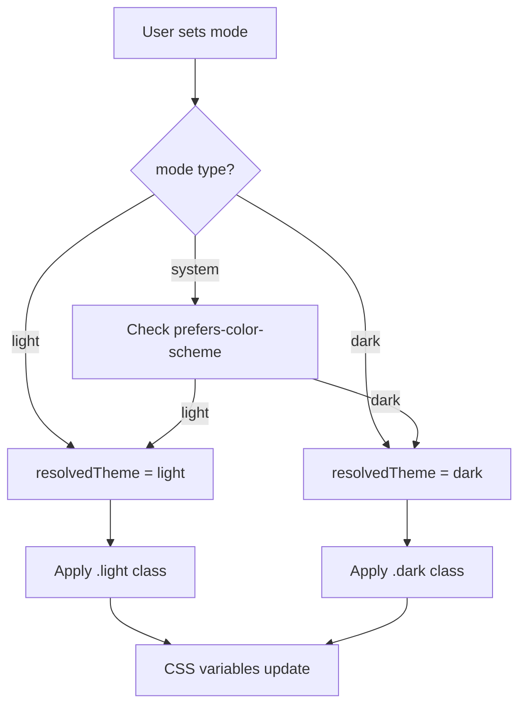

### CSS Variable Architecture

Theme colors are defined in `src/styles/globals.css` using CSS custom properties:

```css
:root {
  --color-bg-primary: #ffffff;
  --color-text-primary: #1a1a2e;
  /* ... */
}

.dark {
  --color-bg-primary: #1a1a2e;
  --color-text-primary: #f8fafc;
  /* ... */
}
```

### System Preference Detection

The theme store listens for system preference changes:

```typescript
const mediaQuery = window.matchMedia('(prefers-color-scheme: dark)');
mediaQuery.addEventListener('change', handleChange);
```

When `mode === 'system'`, the resolved theme updates automatically when the OS preference changes.

### Initialization

Call `initializeTheme()` in `main.tsx` to set up the theme system and listener:

```typescript
import { initializeTheme } from '@/stores/themeStore';
initializeTheme();
```

---

## Geographic View

The application provides an interactive map view for visualizing network topology on a real-world map using Leaflet.

### Architecture

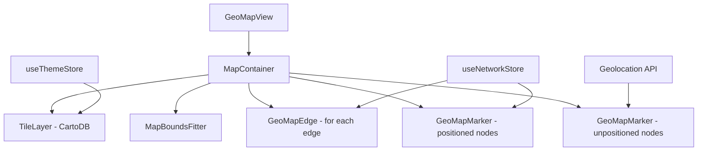

### Components

**GeoMapView** (`src/components/topology/GeoMapView.tsx`):
- Main container for the map view
- Uses CartoDB tiles (CORS-friendly, no API key needed)
- Theme-aware: light (Voyager) or dark (Dark Matter) tiles
- Shows info banner for nodes without coordinates

**GeoMapMarker** (`src/components/topology/GeoMapMarker.tsx`):
- Custom Leaflet DivIcon markers for nodes
- Color-coded by node type
- Visual indicator for unpositioned nodes
- Click to select and open inspector

**GeoMapEdge** (`src/components/topology/GeoMapEdge.tsx`):
- Polyline rendering for edges between nodes
- Supports service path highlighting (working/protection)
- Click to select and open edge inspector

**MapBoundsFitter**:
- Auto-zooms map to fit all nodes
- Single node: centers with zoom 10
- Multiple nodes: fits bounds with padding

### Unpositioned Nodes

Nodes without coordinates are displayed using a golden-angle spiral layout:

```typescript
const angle = (index * 137.5 * Math.PI) / 180;
const radius = offset * Math.sqrt(index + 1);
```

This spreads nodes evenly around the user's location (or default center).

### Tile Layers

| Theme | Tile Provider | Style |
|-------|--------------|-------|
| Light | CartoDB | Voyager (colorful, detailed) |
| Dark | CartoDB | Dark Matter (dark theme) |

### Service Path Visualization

When a service is selected, its paths are highlighted on the map:
- **Working path**: Blue solid line
- **Protection path**: Green dashed line

---

## Location Picker

The Location Picker Modal allows users to set node coordinates by clicking on a map.

### LocationPickerModal Component

**File:** `src/components/topology/LocationPickerModal.tsx`

**Props:**
| Prop | Type | Description |
|------|------|-------------|
| `open` | `boolean` | Modal visibility |
| `onClose` | `() => void` | Close handler |
| `initialLocation` | `{ latitude?: number; longitude?: number }` | Starting position |
| `onSelect` | `(lat: number, lng: number) => void` | Coordinate selection handler |

### Interactions

1. **Click to place**: Click anywhere on the map to place a marker
2. **Drag to adjust**: Drag the marker to fine-tune the position
3. **Confirm**: Click "Confirm Location" to save coordinates

### Integration

The Location Picker is integrated with the `LocationSection` component in the Node Inspector:

```typescript
<Button onClick={() => setShowLocationPicker(true)}>
  Pick on Map
</Button>

<LocationPickerModal
  open={showLocationPicker}
  onClose={() => setShowLocationPicker(false)}
  initialLocation={node?.location}
  onSelect={handleLocationSelect}
/>
```

---

## Grid Controls

The canvas grid can be configured for visibility, size, and snap behavior.

### UI Store Grid Settings

```typescript
interface UIState {
  gridVisible: boolean;
  gridSize: GridSize;  // 20 | 40 | 80
  snapToGrid: boolean;
  setGridVisible: (visible: boolean) => void;
  setGridSize: (size: GridSize) => void;
  setSnapToGrid: (snap: boolean) => void;
  toggleGrid: () => void;
}
```

### Grid Size Options

| Size | Use Case |
|------|----------|
| 20px | Fine-grained positioning |
| 40px | Default, balanced |
| 80px | Coarse positioning, large topologies |

### Toolbar Integration

The Toolbar includes a Grid dropdown menu with:
- **Show Grid**: Toggle visibility
- **Snap to Grid**: Toggle snap behavior
- **Grid Size**: Radio group for 20/40/80px

### Theme-Aware Grid

Grid lines adapt to the current theme:
- **Light mode**: Subtle gray lines (`#e5e7eb`)
- **Dark mode**: Darker lines (`#374151`)

---

## Delete Confirmation

The application shows a confirmation modal before deleting elements, with impact analysis.

### ConfirmDeleteModal Component

**File:** `src/components/topology/ConfirmDeleteModal.tsx`

### Impact Analysis

The modal calculates and displays:

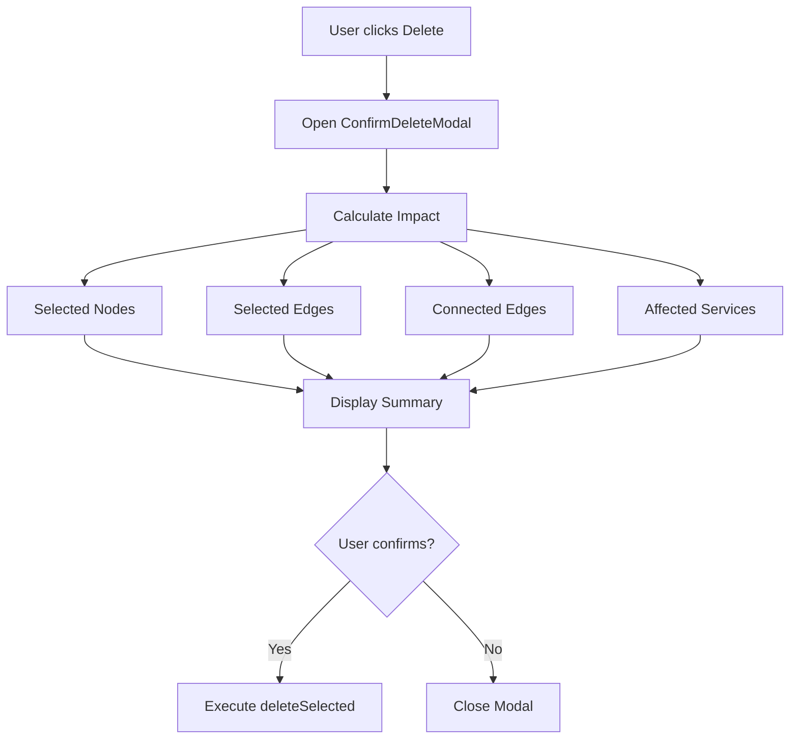

### Impact Categories

| Category | Description | Indicator |
|----------|-------------|-----------|
| Nodes | Directly selected nodes | Red bullet |
| Edges | Directly selected edges | Red bullet |
| Connected Edges | Edges attached to selected nodes | Orange bullet, warning box |
| Affected Services | Services using deleted elements | Red bullet, danger box |

### Trigger Points

The modal is triggered by:
- **Delete key**: Opens modal for selected elements
- **Toolbar delete button**: Same behavior
- **Context menu delete**: (if implemented)

---

## Node Icons

Network nodes display type-specific icons using lucide-react.

### NodeIcon Component

**File:** `src/components/topology/NodeIcon.tsx`

```typescript
interface NodeIconProps {
  iconName: string;
  className?: string;
  size?: number;
}

const NodeIcon: React.FC<NodeIconProps> = ({ iconName, className, size = 20 }) => {
  const IconComponent = ICON_MAP[iconName] || Box;
  return <IconComponent className={className} size={size} />;
};
```

### Icon Mapping

| Node Type | Icon | Lucide Component |
|-----------|------|-----------------|
| Router | Router | `Router` |
| Switch | Network | `Network` |
| OADM | Waypoints | `Waypoints` |
| Amplifier | Signal | `Signal` |
| Terminal | Server | `Server` |
| OSP Termination | Cable | `Cable` |
| Custom | Box | `Box` |

### Usage

```typescript
import { getNodeTypeIcon } from '@/components/topology/NodeIcon';

const IconComponent = getNodeTypeIcon(node.type);
<IconComponent size={16} className="text-text-primary" />
```

---

## In-App Help (WikiModal)

The WikiModal provides built-in documentation accessible from the Header.

### WikiModal Component

**File:** `src/components/layout/WikiModal.tsx`

### Layout

Two-panel design:
- **Left sidebar**: Navigation menu with 8 sections
- **Right content**: Documentation content for selected section

### Sections

| Section | ID | Description |
|---------|-----|-------------|
| Getting Started | `getting-started` | Quick start guide |
| Node Types | `node-types` | Node type descriptions with colors |
| Creating Connections | `connections` | Edge creation instructions |
| Port Configuration | `ports` | Port types and data rates |
| Service Creation | `services` | Service wizard overview |
| Keyboard Shortcuts | `shortcuts` | Hotkey reference |
| Import/Export | `import-export` | File operations |
| Troubleshooting | `troubleshooting` | Common issues and solutions |

### Access

The Wiki is accessible via:
- **Header help icon**: Opens WikiModal
- **Keyboard**: `?` key opens the dedicated Shortcuts Modal

---

## Multi-Element Selection

The application supports simultaneous selection of nodes AND edges, enabling bulk operations on mixed element types.

### Selection Behavior

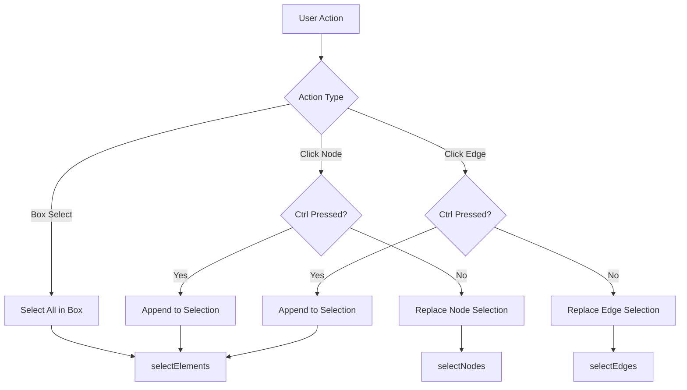

### Key Features

1. **No Mutual Exclusivity** - Selecting nodes does NOT clear edge selection and vice versa
2. **Ctrl-Click Append** - Hold Ctrl to add elements to existing selection
3. **Box Selection** - Shift-drag to select multiple nodes and edges in a region
4. **Combined Delete** - Delete key removes all selected nodes AND edges

### Implementation

**networkStore.ts:**

```typescript
// Select both nodes and edges simultaneously
selectElements: (nodeIds, edgeIds, append = false) => {
  set((state) => {
    if (append) {
      state.selectedNodeIds = [...new Set([...state.selectedNodeIds, ...nodeIds])];
      state.selectedEdgeIds = [...new Set([...state.selectedEdgeIds, ...edgeIds])];
    } else {
      state.selectedNodeIds = nodeIds;
      state.selectedEdgeIds = edgeIds;
    }
  });
},
```

**Canvas.tsx:**

```typescript
// Track Ctrl key for append mode
const [isCtrlPressed, setIsCtrlPressed] = useState(false);

// Handle box selection from React Flow
const onSelectionChange: OnSelectionChangeFunc = useCallback(
  ({ nodes, edges }) => {
    selectElements(
      nodes.map(n => n.id),
      edges.map(e => e.id),
      isCtrlPressed
    );
  },
  [selectElements, isCtrlPressed]
);
```

---

## Port Configuration System

The application supports optical port configuration on network nodes, enabling realistic modeling of DWDM and black/white optical connections.

### Port Types

| Port Type | Wavelength | Max Channels | Max Distance | Use Case |
|-----------|------------|--------------|--------------|----------|
| B/W | 1310nm | 1 | 10 km | Short-haul synchronous links |
| DWDM | 1550nm | 96 | 150 km | Long-haul wavelength division multiplexing |

### Port Interface

```typescript
interface Port {
  id: string;
  name: string;
  type: 'bw' | 'dwdm';
  dataRate: '1G' | '10G' | '25G' | '100G' | '400G';
  channels: number;
  status: 'available' | 'used';
  connectedEdgeId?: string;
}
```

### Default Ports by Node Type

| Node Type | Default Ports |
|-----------|---------------|
| Router | 4x 10G B/W (Eth), 2x 100G DWDM (Line) |
| Switch | 8x 1G B/W (Port), 4x 10G B/W (Uplink) |
| OADM | 2x DWDM Line, 4x DWDM Add ports (96ch each) |
| Amplifier | 2x DWDM (IN/OUT, 96ch each) |
| Terminal | 4x 10G B/W (Client), 2x 100G DWDM (Line) |
| Custom | 2x 10G B/W (user-defined) |

### Port Validation

Connections are validated before creation using utilities in `src/core/validation/portValidation.ts`:

```typescript
validatePortConnection(sourcePort, targetPort, distance?)  // Full validation
validateDistance(portType, distance)                       // Distance limits
arePortTypesCompatible(type1, type2)                      // Type compatibility
validateConnectionDistance(srcType, tgtType, distance)    // Combined check
```

### Edge-Port Relationship

When creating an edge:
1. User selects source and target nodes
2. `SelectPortsModal` shows available ports on each node
3. User selects one port from each node
4. Validation ensures port types match and distance is within limits
5. Edge is created with port references (`sourcePortId`, `targetPortId`)
6. Port status changes to 'used' with `connectedEdgeId` set

When deleting an edge:
1. Connected ports are found via `connectedEdgeId`
2. Port status changes back to 'available'
3. `connectedEdgeId` is cleared
4. Edge is removed

---

## OSP Termination Nodes

OSP (Outside Plant) Termination nodes are **passive components** that create breakpoints in fiber routes. They allow different fiber sections to have different profiles, attenuations, and insertion losses. OSP nodes are **transparent to path finding** - they do not affect routing decisions.

### OSP Termination Types

| Type | Label | Description | Typical Loss |
|------|-------|-------------|--------------|
| `splice-closure` | Splice Closure | Weatherproof enclosure for fiber splices | 0.02 - 0.1 dB |
| `fdf` | Fiber Distribution Frame | Indoor fiber management and patching point | 0.3 - 1.0 dB |
| `patch-panel` | Patch Panel | Fiber patch and cross-connect panel | 0.3 - 0.7 dB |
| `handhole` | Handhole | Underground access point for fiber splices | 0.1 - 0.5 dB |
| `manhole` | Manhole | Large underground access chamber | 0.1 - 0.5 dB |
| `splitter` | Passive Splitter | Optical power splitter (1:N) | 3.5 - 21.0 dB |
| `generic` | Generic OSP | Generic outside plant termination point | 0.1 - 1.0 dB |

### Type Definitions

```typescript
// OSP termination types
type OSPTerminationType =
  | 'splice-closure'
  | 'fdf'
  | 'patch-panel'
  | 'handhole'
  | 'manhole'
  | 'splitter'
  | 'generic';

// Splitter ratios
type SplitterRatio = '1:2' | '1:4' | '1:8' | '1:16' | '1:32' | '1:64';

// Splitter configuration
interface SplitterConfig {
  splitRatio: SplitterRatio;
  splitterLoss: number;  // dB
}

// Port mapping for internal connections
interface PortMapping {
  inputPortId: string;
  outputPortIds: string[];  // Array for splitter (1:N)
}

// OSP termination properties
interface OSPTerminationProperties {
  terminationType: OSPTerminationType;
  insertionLoss: number;           // dB
  reflectance?: number;            // dB (negative value)
  fiberCount?: number;             // Fiber pairs
  isWeatherproof?: boolean;
  splitterConfig?: SplitterConfig; // Only for splitter type
  portMappings?: PortMapping[];    // Internal port connections
}
```

### Splitter Loss Table

| Ratio | Typical Loss |
|-------|-------------|
| 1:2 | 3.5 dB |
| 1:4 | 7.0 dB |
| 1:8 | 10.5 dB |
| 1:16 | 14.0 dB |
| 1:32 | 17.5 dB |
| 1:64 | 21.0 dB |

### Default Ports

OSP Termination nodes come with 4 default ports:

| Port Name | Type | Data Rate | Channels |
|-----------|------|-----------|----------|
| BW-In | B/W | 10G | 1 |
| BW-Out | B/W | 10G | 1 |
| DWDM-In | DWDM | 100G | 96 |
| DWDM-Out | DWDM | 100G | 96 |

### Port Mapping

OSP nodes support internal port mapping to define how signals pass through:

- **Pass-through mode**: 1:1 mapping (input → single output)
- **Splitter mode**: 1:N mapping (input → multiple outputs)

The PortMappingEditor component provides a visual interface for configuring mappings.

### Validation

OSP properties are validated using `src/core/validation/ospValidation.ts`:

```typescript
validateOSPProperties(props)        // Full validation
validateInsertionLoss(type, loss)   // Loss range by type
validateReflectance(reflectance)    // Reflectance range
validateSplitterConfig(config)      // Splitter validation
validatePortMappings(mappings, ports, isSplitter)
```

### Key Behaviors

1. **Transparent to Path Finding**: OSP nodes do not affect shortest path calculations
2. **Different Fiber Profiles**: Each edge connected to an OSP can have a different fiber profile
3. **Insertion Loss Accumulation**: Total path loss includes all OSP insertion losses
4. **DWDM Transparency**: Wavelengths pass through without blocking

---

## Node Location Metadata

All network nodes support optional physical location metadata for geographic mapping and documentation.

### Location Interface

```typescript
type InstallationType = 'indoor' | 'outdoor' | 'underground' | 'aerial';

interface NodeLocation {
  latitude?: number;          // Decimal degrees (-90 to 90)
  longitude?: number;         // Decimal degrees (-180 to 180)
  address?: string;           // Street address
  building?: string;          // Building/facility name
  floor?: string;             // Floor/level
  room?: string;              // Room/cabinet identifier
  installationType?: InstallationType;
}
```

### UI Component

The `LocationSection` component provides a collapsible form in the Node Inspector:

- Latitude/Longitude inputs with range validation
- Address text field
- Building/Floor/Room fields
- Installation type dropdown

### Validation

Location metadata is validated using `src/core/validation/nodeValidation.ts`:

```typescript
validateNodeLocation(location)      // Full validation
validateNodeName(name)              // Name validation
validateNodePosition(position)      // Canvas position
validateNetworkNode(node)           // Complete node
calculateGeoDistance(loc1, loc2)    // Distance in km
areNodesColocated(loc1, loc2, tolerance)
```

### Geographic Distance Calculation

The `calculateGeoDistance()` function uses the Haversine formula to calculate great-circle distance between two nodes with coordinates:

```typescript
const nyc = { latitude: 40.7128, longitude: -74.006 };
const la = { latitude: 34.0522, longitude: -118.2437 };

const distance = calculateGeoDistance(nyc, la);
// Returns: ~3944 km
```

---

## Fiber Parameter Profiles

The application supports ITU-T standard fiber profiles for accurate optical link modeling. This enables calculation of span impairments and validation of fiber parameters.

### ITU-T Profile Types

| Profile | Label | Description | Attenuation | CD | PMD | Eff. Area |
|---------|-------|-------------|-------------|----|----|-----------|
| G.652.D | Standard SMF | Standard single-mode fiber | 0.20 dB/km | 17 ps/(nm·km) | 0.1 ps/√km | 80 μm² |
| G.654.E | Submarine | Long-haul/submarine, low loss | 0.17 dB/km | 20 ps/(nm·km) | 0.1 ps/√km | 125 μm² |
| G.655 | NZDSF | Non-zero dispersion-shifted for DWDM | 0.22 dB/km | 4.5 ps/(nm·km) | 0.1 ps/√km | 72 μm² |
| G.657.A1 | Bend-insensitive | Access networks with tight bends | 0.25 dB/km | 17 ps/(nm·km) | 0.2 ps/√km | 80 μm² |
| Custom | User-defined | Fully customizable parameters | User | User | User | User |

### Type Definitions

```typescript
// Fiber profile types
type FiberProfileType = 'G.652.D' | 'G.654.E' | 'G.655' | 'G.657.A1' | 'custom';

// Fiber profile with optical parameters
interface FiberProfile {
  type: FiberProfileType;
  label: string;
  description: string;
  attenuation: number;           // dB/km at 1550nm
  chromaticDispersion: number;   // ps/(nm·km) at 1550nm
  pmd: number;                   // ps/√km (PMD coefficient)
  effectiveArea?: number;        // μm²
  nonLinearIndex?: number;       // n2 in m²/W
}

// Fiber parameters with optional overrides
interface FiberParameters {
  profileType: FiberProfileType;
  attenuationOverride?: number;
  chromaticDispersionOverride?: number;
  pmdOverride?: number;
  effectiveAreaOverride?: number;
  nonLinearIndexOverride?: number;
}
```

### Profile Selection and Override Flow

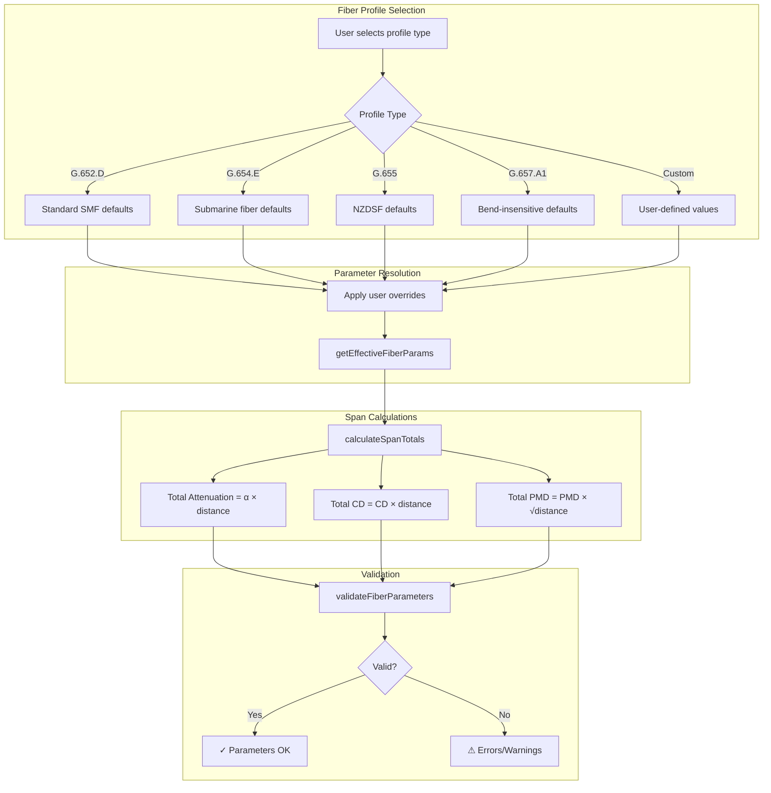

### Span Calculations

The fiber validation module calculates span totals based on fiber parameters and distance:

| Parameter | Formula | Unit |
|-----------|---------|------|
| Total Attenuation | `α × distance` | dB |
| Total Chromatic Dispersion | `CD × distance` | ps/nm |
| Total PMD | `PMD × √distance` | ps |

```typescript
import { getEffectiveFiberParams, calculateSpanTotals } from '@/core/validation/fiberValidation';

// Get effective parameters with overrides applied
const effectiveParams = getEffectiveFiberParams(edge.properties.fiberProfile);

// Calculate totals for a 100km span
const spanTotals = calculateSpanTotals(effectiveParams, 100);
// Result: { totalAttenuation: 20, totalChromaticDispersion: 1700, totalPMD: 1.0 }
```

### SRLG Code Management

Shared Risk Link Groups (SRLGs) identify edges that share a common failure point (e.g., same duct, conduit, or cable route). The `SRLGCodeEditor` component provides tag-based management:

```typescript
// SRLG codes stored on edge properties
interface EdgeProperties {
  // ... other properties
  srlgCodes?: string[];  // e.g., ['DUCT-NYC-01', 'CABLE-A1']
}

// Validation
validateSRLGCode(code)     // Format: alphanumeric with hyphens/underscores
isDuplicateSRLGCode(code, existingCodes)
formatSRLGCode(code)       // Uppercase normalization
```

### UI Components

**FiberProfileSection** (`src/components/topology/FiberProfileSection.tsx`):
- Dropdown for profile type selection
- Override inputs for each optical parameter
- Real-time span calculations display
- Validation feedback (errors/warnings)

**SRLGCodeEditor** (`src/components/topology/SRLGCodeEditor.tsx`):
- Tag-based SRLG code input
- Add/remove individual codes
- Format validation
- Duplicate detection

**SelectPortsModal** fiber integration:
- Fiber profile selector during edge creation
- Default profile: G.652.D (standard SMF)
- Profile stored in `EdgeProperties.fiberProfile`

---

## DWDM Channel/Lambda Spectrum Management

The application supports ITU-T G.694.1 standard DWDM channel tracking, enabling precise wavelength assignment and spectrum management for optical connections.

### Channel Grid Types

| Grid Type | Spacing | Channels | Use Case |
|-----------|---------|----------|----------|
| Fixed 100 GHz | 100 GHz (0.1 THz) | ~48 | Legacy DWDM systems |
| Fixed 50 GHz | 50 GHz (0.05 THz) | ~96 | Modern DWDM systems |
| Flex Grid | 12.5 GHz slots | ~384 slots | Super-channel, 400G+ coherent |

### Type Definitions

```typescript
// Channel grid types (ITU-T G.694.1)
type ChannelGridType = 'fixed-100ghz' | 'fixed-50ghz' | 'flex-grid';
type ChannelStatus = 'free' | 'allocated' | 'reserved';

// Channel allocation record
interface ChannelAllocation {
  id: string;
  channelNumber?: number;         // Fixed grid: ITU-T channel number
  slotRange?: { startSlot: number; endSlot: number };  // Flex grid
  status: ChannelStatus;
  edgeId?: string;                // Edge using this allocation
  label?: string;                 // User label
}

// Port spectrum configuration
interface PortSpectrum {
  gridType: ChannelGridType;
  allocations: ChannelAllocation[];
}

// Edge channel assignment
interface EdgeChannelAssignment {
  sourceChannels: ChannelAllocation[];
  targetChannels: ChannelAllocation[];
  isExpress: boolean;             // Same wavelength end-to-end
}
```

### Channel Numbering (ITU-T G.694.1)

Channel frequencies are calculated from the reference frequency:
- **Reference**: 193.1 THz (λ ≈ 1552.52 nm)
- **Formula**: f = 193.1 + n × Δf (THz)
  - 100 GHz grid: Δf = 0.1 THz
  - 50 GHz grid: Δf = 0.05 THz
- **Flex grid slot**: f = 193.1 + n × 0.00625 THz

### Channel Numbering Systems

The system uses two channel numbering conventions that must be properly converted:

#### 1. User-Friendly Numbers (1-96)
Used in ChannelChecker, Service Wizard, and UI display:
- Range: 1 to 96 (simple 1-based numbering)
- Channel 1 = lowest frequency (191.35 THz)
- Channel 96 = highest frequency (196.10 THz)

#### 2. ITU-T Standard Numbers (-35 to 60)
Used in spectrum storage and visualization:
- Formula: `f = 193.1 + n × 0.05 THz` (for 50 GHz grid)
- Channel -35 = 191.35 THz (same as user CH-1)
- Channel 60 = 196.10 THz (same as user CH-96)

#### Conversion Functions

Located in `src/core/spectrum/channelConfig.ts`:

```typescript
// Convert user channel (1-96) to ITU-T format (-35 to 60)
userToItuChannel(userChannel: number, gridType: 'fixed-100ghz' | 'fixed-50ghz'): number

// Convert ITU-T format to user channel
ituToUserChannel(ituChannel: number, gridType: 'fixed-100ghz' | 'fixed-50ghz'): number

// Format ITU-T channel for display (returns "CH1", "CH2", etc.)
formatChannelLabel(ituChannel: number, gridType: 'fixed-100ghz' | 'fixed-50ghz'): string
```

#### Channel Data Flow

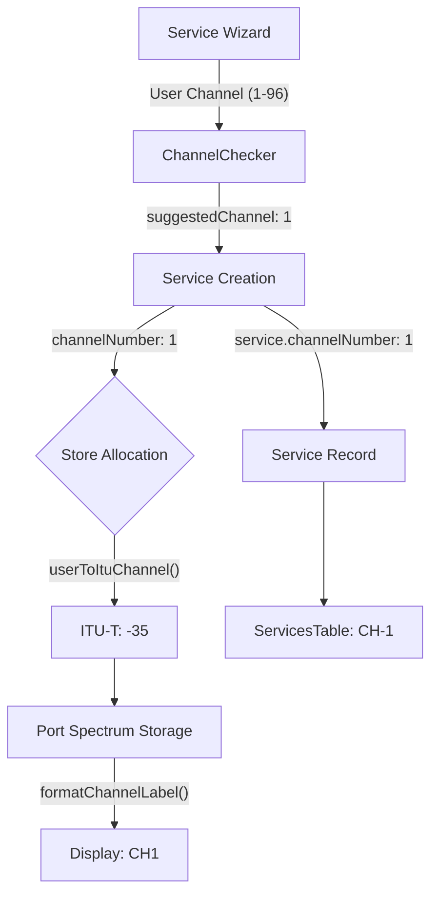

**Key Points:**
- **ChannelChecker** returns user-friendly channel numbers (1-96)
- **Service records** store the user-friendly channel number for display
- **Port spectrum allocations** must store ITU-T format for correct visualization
- **UI components** convert back to user-friendly format for display

### Store Actions

```typescript
// Initialize port spectrum
initializePortSpectrum(nodeId, portId, gridType: ChannelGridType)

// Change port grid type (clears allocations)
setPortGridType(nodeId, portId, gridType: ChannelGridType)

// Allocate channels on a port
allocateChannels(nodeId, portId, channels: ChannelAllocation[], edgeId?)

// Deallocate channels
deallocateChannels(nodeId, portId, allocationIds: string[])
deallocateChannelsByEdge(nodeId, portId, edgeId: string)

// Query functions
getPortSpectrum(nodeId, portId): PortSpectrum | null
getFreeChannels(nodeId, portId): number[]
```

### Validation Functions

```typescript
import {
  validateChannelAvailability,
  validateFlexGridSlots,
  validateEdgeChannelAssignment,
  validateSpectralContinuity,
  getSpectrumUtilization
} from '@/core/validation/channelValidation';

// Check if a channel is available
validateChannelAvailability(spectrum, channelNumber)

// Validate flex-grid slot range (no overlap)
validateFlexGridSlots(spectrum, startSlot, endSlot)

// Validate edge assignment
validateEdgeChannelAssignment(sourceSpectrum, targetSpectrum, assignment)

// Check express connection continuity
validateSpectralContinuity(sourceChannels, targetChannels)

// Get utilization metrics
const util = getSpectrumUtilization(spectrum);
// { totalChannels, allocatedChannels, freeChannels, utilizationPercent }
```

### Channel Configuration Helpers

```typescript
import {
  frequencyToWavelength,
  wavelengthToFrequency,
  channelNumberToFrequency,
  getChannelDisplayInfo,
  getFlexGridSlotInfo,
  getChannelRange,
  isValidChannelNumber
} from '@/core/spectrum/channelConfig';

// Frequency/wavelength conversion
const wavelength = frequencyToWavelength(193.1);  // 1552.52 nm
const freq = wavelengthToFrequency(1550);         // ~193.41 THz

// Channel info
const info = getChannelDisplayInfo(0, 'fixed-100ghz');
// { number: 0, frequency: '193.10 THz', wavelength: '1552.52 nm', spacing: '100 GHz' }

// Flex-grid slot info
const slotInfo = getFlexGridSlotInfo(0, 4);
// { startFrequency, endFrequency, centerFrequency, bandwidthGHz, ... }
```

### UI Components

**SpectrumVisualization** (`src/components/topology/SpectrumVisualization.tsx`):
- Visual C-band spectrum bar (191.35-196.10 THz)
- Color-coded segments: green=free, red=allocated, yellow=reserved, blue=selected
- Hover tooltips with channel/frequency/wavelength info
- Click to select channels

**ChannelSelector** (`src/components/topology/ChannelSelector.tsx`):
- Grid type selector (100 GHz / 50 GHz / Flex Grid)
- Spectrum visualization integration
- Channel number input for fixed grids
- Slot range selection for flex-grid
- Quick-select common flex-grid widths

**MiniSpectrumBar** (compact view):
- Small spectrum utilization indicator
- Used in PortConfigurationSection for DWDM ports

### Connection Workflow

1. User creates edge between two DWDM ports
2. SelectPortsModal shows channel selector (for DWDM connections)
3. User selects channel from spectrum visualization
4. Optional: Enable "Express" for same-wavelength end-to-end
5. Channel allocations created on both ports
6. Edge stores `channelAssignment` in properties

When edge is deleted:
1. Channel allocations are deallocated from source/target ports
2. Port spectrum updated to show channels as free

### Spectrum Management Workflow

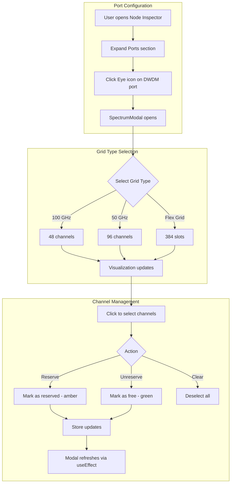

### SpectrumModal Component

**SpectrumModal** (`src/components/topology/SpectrumModal.tsx`):
- Full-screen spectrum visualization dialog
- Grid type selector buttons (100 GHz / 50 GHz / Flex Grid)
- Statistics panel showing total, available, allocated channels
- Color legend (free, allocated, reserved, selected)
- Interactive channel selection with click-to-toggle
- Reserve/Unreserve buttons for selected channels
- Channel numbering info box

**Props:**
| Prop | Type | Description |
|------|------|-------------|
| `spectrum` | `PortSpectrum` | The spectrum data to display |
| `title` | `string` | Modal title |
| `subtitle` | `string?` | Optional description |
| `readOnly` | `boolean?` | Disable selection/reservation |
| `onGridTypeChange` | `(gridType) => void` | Grid type change handler |
| `onReserveChannels` | `(channels: number[]) => void` | Reserve selected channels |
| `onUnreserveChannels` | `(channels: number[]) => void` | Unreserve selected channels |

---

## Service Management

The service management system provides complete lifecycle management for optical (L1) and IP (L2/L3) network services.

### Architecture

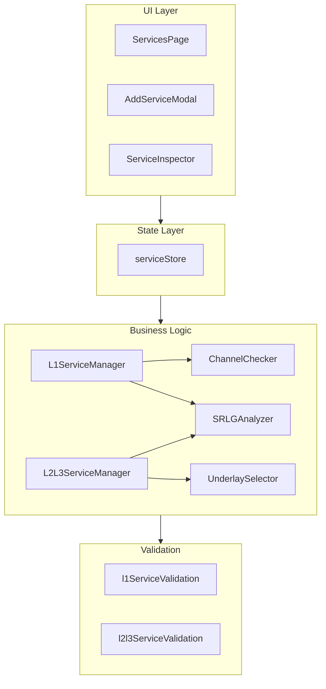

### Service Types

| Type | Description | Key Features |
|------|-------------|--------------|
| L1-DWDM | Optical wavelength service | Channel allocation, modulation types, 1+1/OLP/SNCP protection |
| L2-Ethernet | Ethernet over L1 underlay | L1 underlay selection, BFD configuration |
| L3-IP | IP service over L1 underlay | L1 underlay selection, IP protection schemes |

### Core Components

#### ServiceManager (`src/core/services/ServiceManager.ts`)

Base service operations and validation orchestration:

```typescript
class ServiceManager {
  validateServiceConfig(config: ServiceConfig): ValidationResult;
  computePath(source: string, target: string, options: PathOptions): ServicePath;
  getAvailableChannels(path: ServicePath): number[];
}
```

#### L1ServiceManager (`src/core/services/L1ServiceManager.ts`)

Complete L1 DWDM service creation workflow:

```typescript
interface L1ServiceCreateResult {
  success: boolean;
  service?: L1DWDMService;
  workingPath: ServicePath;
  protectionPath?: ServicePath;
  channelAssignment: ChannelAssignment;
  srlgAnalysis?: SRLGRiskAnalysis;
  errors: string[];
  warnings: string[];
}

class L1ServiceManager {
  createL1Service(config: L1ServiceConfig): L1ServiceCreateResult;
}
```

**Modulation Reach Limits:**

| Modulation | Max Reach | Typical Use |
|------------|-----------|-------------|
| DP-QPSK | 2500 km | Long-haul, submarine |
| DP-8QAM | 1500 km | Regional networks |
| DP-16QAM | 800 km | Metro-regional |
| DP-32QAM | 400 km | Metro |
| DP-64QAM | 120 km | Short metro |

#### L2L3ServiceManager (`src/core/services/L2L3ServiceManager.ts`)

L2/L3 IP service creation with underlay selection:

```typescript
interface L2L3ServiceCreateResult {
  success: boolean;
  service?: L2L3Service;
  underlayService: L1DWDMService;
  protectionUnderlay?: L1DWDMService;
  sharedPortionAnalysis?: SharedPortionAnalysis;
  errors: string[];
  warnings: string[];
}

class L2L3ServiceManager {
  createL2L3Service(config: L2L3ServiceConfig): L2L3ServiceCreateResult;
}
```

#### ChannelChecker (`src/core/services/ChannelChecker.ts`)

DWDM channel availability analysis across paths:

```typescript
interface ChannelAvailabilityResult {
  availableChannels: number[];      // Channels free on all edges
  partialChannels: PartialChannel[]; // Channels with gaps
  continuousRanges: ChannelRange[];  // Contiguous free ranges
  utilizationByEdge: Map<string, number>;
}

class ChannelChecker {
  checkChannelAvailability(path: ServicePath, mode: 'continuous' | 'conversion'): ChannelAvailabilityResult;
  findBestChannel(result: ChannelAvailabilityResult): number | null;
}
```

- **Continuous mode**: Requires same channel on all path edges (express lightpath)
- **Conversion mode**: Allows wavelength conversion at intermediate nodes

#### SRLGAnalyzer (`src/core/services/SRLGAnalyzer.ts`)

Path diversity analysis with SRLG risk scoring:

```typescript
interface SRLGRiskAnalysis {
  sharedSRLGs: string[];           // Common SRLG codes
  workingOnlySRLGs: string[];      // SRLGs only on working path
  protectionOnlySRLGs: string[];   // SRLGs only on protection path
  riskScore: number;               // 0-100 (0 = fully diverse)
  sharedEdges: string[];           // Edges sharing SRLGs
  sharedDistanceKm: number;        // Total shared distance
  recommendation: string;          // Risk assessment text
}

class SRLGAnalyzer {
  comparePaths(workingPath: ServicePath, protectionPath: ServicePath): SRLGRiskAnalysis;
  getSRLGsForPath(path: ServicePath): Set<string>;
}
```

#### UnderlaySelector (`src/core/services/UnderlaySelector.ts`)

Intelligent L1 service selection for L2/L3 underlays:

```typescript
interface UnderlayCandidate {
  service: L1DWDMService;
  score: number;
  availableCapacity: number;
  pathMatch: 'exact' | 'partial' | 'none';
}

class UnderlaySelector {
  selectBestUnderlay(source: string, target: string, requiredRate: DataRate): UnderlayCandidate | null;
  selectDiverseUnderlay(workingUnderlay: L1DWDMService, source: string, target: string): UnderlayCandidate | null;
  analyzeSharedPortion(underlay1: L1DWDMService, underlay2: L1DWDMService): SharedPortionAnalysis;
}
```

### L1 Service Creation Flow

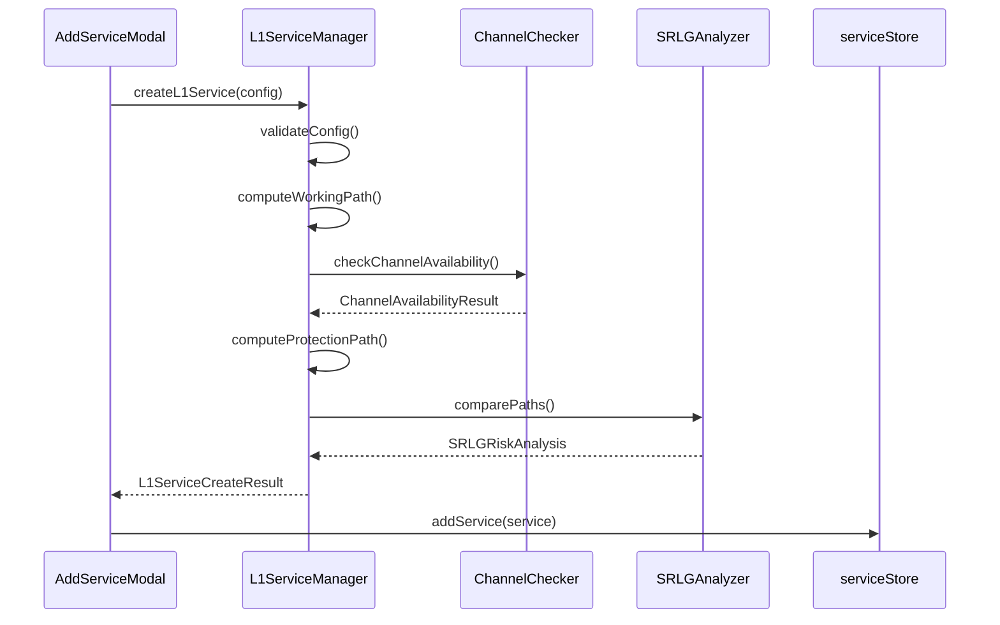

### Service Store API

```typescript
interface ServiceStore {
  // State
  services: Service[];
  selectedServiceIds: string[];
  filters: ServiceFilters;
  sortBy: SortConfig;

  // CRUD Operations
  addService(service: Service): void;
  updateService(id: string, updates: Partial<Service>): void;
  removeService(id: string): void;
  getService(id: string): Service | undefined;

  // Query Operations
  getServicesByNode(nodeId: string): Service[];
  getServicesByEdge(edgeId: string): Service[];
  getL1ServicesForEndpoints(sourceId: string, targetId: string): L1DWDMService[];

  // Status Operations
  activateService(id: string): void;
  deactivateService(id: string): void;
  failService(id: string, reason: string): void;

  // Bulk Operations
  bulkActivate(ids: string[]): void;
  bulkDeactivate(ids: string[]): void;
  bulkDelete(ids: string[]): void;

  // Import/Export
  importServices(services: Service[]): void;
  exportServices(): Service[];
}
```

**ID Generation:**
- L1-DWDM services: `L1-001`, `L1-002`, ...
- L2-Ethernet services: `L2-001`, `L2-002`, ...
- L3-IP services: `L3-001`, `L3-002`, ...

### Path-Based Underlay Discovery

For L2/L3 service creation over multi-layer topologies (e.g., Router→OADM→Router paths), the system uses path-based underlay discovery to find L1 services that cover the DWDM segments of the computed path.

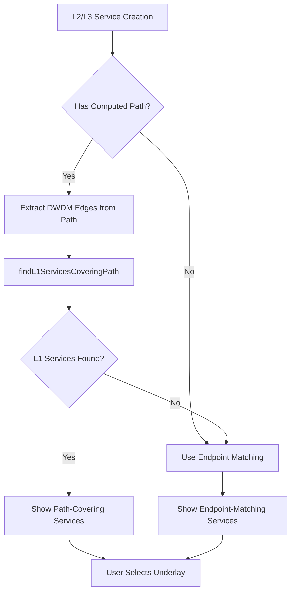

**API:**

```typescript
// serviceStore.ts
findL1ServicesCoveringPath(
  dwdmEdgeIds: string[],      // DWDM edge IDs from the computed path
  minDataRate?: DataRate      // Optional minimum data rate filter
): L1DWDMService[]
```

**Use Case:**
- When creating L2/L3 services, the wizard first computes a path
- If the path traverses OADM nodes (multi-layer), it extracts DWDM edge IDs
- `findL1ServicesCoveringPath()` finds L1 services whose working paths include those edges
- This enables underlay selection even when L1 endpoints differ from L2/L3 endpoints

### Auto-Create L1 Underlay Workflow

When no suitable L1 underlay exists, the Service Wizard can automatically create one for L2/L3 services.

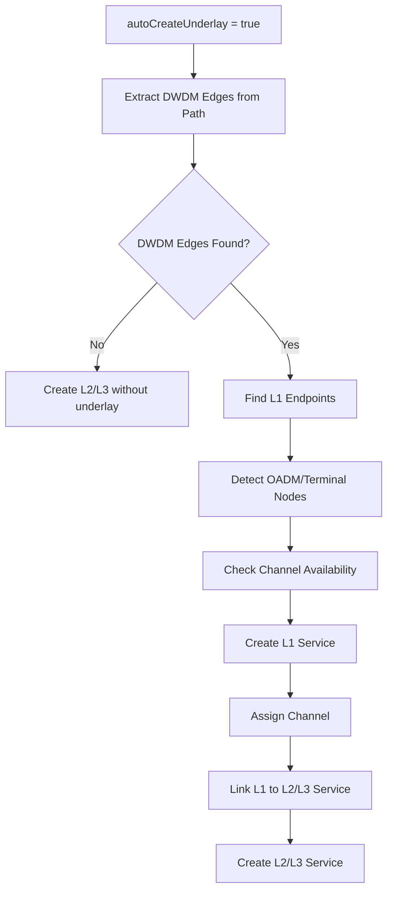

**Implementation Details:**
- Extracts DWDM edges from the computed L2/L3 path
- Identifies L1 endpoints (first and last OADM/Terminal nodes on DWDM edges)
- Uses ChannelChecker to find available channel on the optical path
- Creates L1-DWDM service with auto-generated name
- Links the new L1 service as the underlay for the L2/L3 service

### Service Path Visualization

Selected services highlight their paths on the network canvas with distinct visual styles.

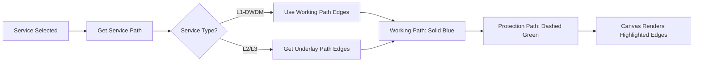

**Visual Styles:**

| Path Type | Color | Line Style | Width |
|-----------|-------|------------|-------|
| Working Path | Blue (#3b82f6) | Solid | 4px |
| Protection Path | Green (#22c55e) | Dashed | 3px |

**Implementation:**
- `Canvas.tsx`: Computes `highlightedEdges` map from selected service paths
- `NetworkEdge.tsx`: Applies stroke color, width, and dash array based on highlight type
- For L2/L3 services, the underlay's working path is highlighted
- Supports both working and protection path visualization

### Validation Rules

#### L1 Service Validation (`src/core/validation/l1ServiceValidation.ts`)

```typescript
validateL1ServiceConfig(config: L1ServiceConfig): ValidationResult;
validateModulationReach(modulation: ModulationType, distance: number): boolean;
validateChannelWidth(width: ChannelWidth, gridType: ChannelGridType): boolean;
validateProtectionConfig(working: ServicePath, protection: ServicePath): ValidationResult;
```

**Validation Checks:**
- Source and target nodes exist and have DWDM ports
- Physical path connectivity
- Modulation reach limits respected
- Channel availability on all path edges
- Protection path SRLG diversity (warnings for shared risk)

#### L2/L3 Service Validation (`src/core/validation/l2l3ServiceValidation.ts`)

```typescript
validateL2L3ServiceConfig(config: L2L3ServiceConfig): ValidationResult;
validateUnderlayCapacity(underlay: L1DWDMService, requiredRate: DataRate): boolean;
validateBFDConfig(config: BFDConfig): ValidationResult;
```

**Validation Checks:**
- Valid L1 underlay service exists
- Underlay has sufficient capacity
- BFD parameters within valid ranges
- Protection underlay diversity from working underlay

### UI Components

#### ServicesPage (`src/pages/ServicesPage.tsx`)
- Route: `/services`
- Full-page service management view
- Header with "Add Service" button
- Filter bar with type, status, and search filters
- Services table with sorting

#### ServicesTable (`src/components/services/ServicesTable.tsx`)
- Sortable columns: ID, Name, Type, Status, Source, Target, Created
- Row selection with checkbox
- Context menu for actions
- Click to open inspector

#### AddServiceModal (`src/components/services/AddServiceModal.tsx`)
- Step-by-step service creation wizard
- Step 1: Select service type
- Step 2: Configure endpoints
- Step 3: Set service parameters
- Step 4: Review and create

#### ServiceInspector (`src/components/services/ServiceInspector.tsx`)
- Detailed service view panel
- Path visualization
- Channel assignment display
- SRLG analysis results
- Status controls

#### ServiceStatusBadge / ServiceTypeBadge (`src/components/services/`)
- Color-coded status indicators: Active (green), Inactive (gray), Failed (red), Provisioning (yellow)
- Type badges: L1-DWDM (blue), L2-Ethernet (purple), L3-IP (orange)

---

## Service Validation Testing

The debug page includes a comprehensive service validation testing framework accessible via the Services tab in TabbedTester.

### ServiceTester Component

**Location:** `src/components/debug/ServiceTester.tsx`

The ServiceTester provides:
- Sample service topology generators
- Quick service creation form
- Service lifecycle operations (activate, deactivate, fail, delete)
- Comprehensive validation test suite

### Test Categories

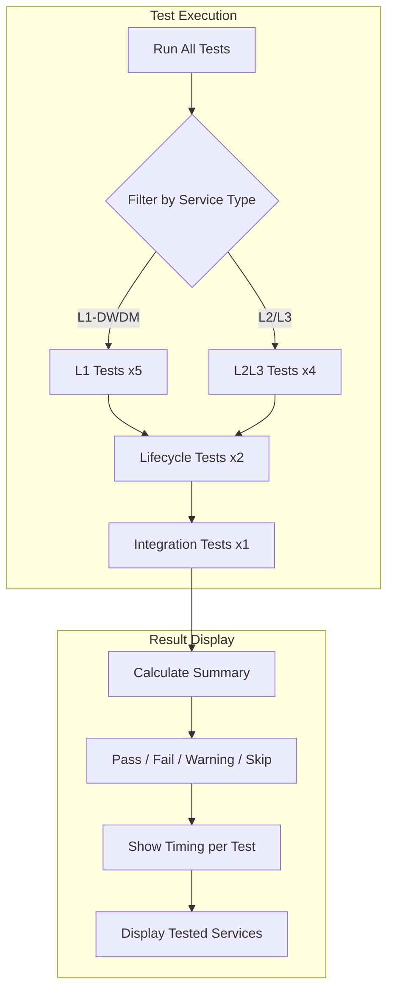

### L1 Validation Tests

| Test | Validation | Pass Criteria |
|------|------------|---------------|
| Endpoint Validation | Source/dest nodes and ports exist | Nodes found in topology |
| Channel Number Range | Channel 1-96 valid | Within ITU-T C-band range |
| Modulation Reach Check | Distance vs modulation limit | Path < DP-QPSK: 2500km, DP-16QAM: 800km, etc. |
| Path Continuity | All edges connect properly | No gaps in working path |
| SRLG Diversity | Working vs protection overlap | Risk score acceptable |

### L2/L3 Validation Tests

| Test | Validation | Pass Criteria |
|------|------------|---------------|
| Underlay Validation | L1 service exists and active | Valid L1 underlay found |
| Capacity Validation | Underlay capacity >= required | Sufficient bandwidth |
| BFD Configuration | Parameter ranges valid | TX/RX intervals, multiplier in range |
| Shared Portion Analysis | Path overlap percentage | Below critical threshold |

### Lifecycle Tests

| Test | Validation | Pass Criteria |
|------|------------|---------------|
| Status Transitions | Service states valid | No active L2/L3 with inactive underlay |
| Dependency Blocking | Delete blocking | L1 services with dependents cannot be deleted |

### Integration Tests

| Test | Validation | Pass Criteria |
|------|------------|---------------|
| Channel Conflict Detection | No duplicate channels on shared edges | No overlapping channel assignments |

### Sample Service Topologies

| Topology | Nodes | Services | Description |
|----------|-------|----------|-------------|
| basic-l1 | 2 | L1 | Simple A-B L1 DWDM service |
| protected-l1 | 4 | L1 w/ protection | Diamond topology with working + protection paths |
| l2-over-l1 | 2 | L1 + L2 | L2 Ethernet service over L1 underlay |
| multi-layer | 2 | L1 + L2 + L3 | Full multi-layer service stack |

### Test Result Format

```
═══════════════════════════════════════
  VALIDATION TEST RESULTS
═══════════════════════════════════════

Tested Services:
  L1: L1-001 (L1-Transport)
  L2/L3: L3-001 (L3-VRF)

L1 Service Tests (5 tests)
─────────────────────────────────────
✓ Endpoint Validation       [PASS]   20.0µs
✓ Channel Number Range      [PASS]   <1µs
  → Channel 1 is valid (range: 1-96)
...

Summary: 12 passed, 0 failed, 0 warnings, 0 skipped
Total Time: 1.5ms
```

---

## Smart Edge Rendering

The NetworkEdge component provides intelligent rendering for edge paths.

### Parallel Edge Detection

Multiple edges between the same node pair are automatically detected and offset to prevent overlap:

```
Node A ====Edge 1==== Node B
       ====Edge 2====
       ====Edge 3====
```

Edges are grouped by handle combination (`nodeId:handle`), and each edge receives a perpendicular offset:

```typescript
offset = (edgeIndex - (groupCount - 1) / 2) * 80  // 80px spacing
```

### Bend Points

Users can define custom control points for edge curves:

```typescript
updateEdgeBendPoint(edgeId: string, position: Position | null)
```

- Set a position to create a user-defined curve path (quadratic bezier)
- Set null to return to automatic routing (cubic bezier)

The bend point is stored in `EdgeProperties.bendPoint` and persisted with the topology.

---

## Cross-Tab Synchronization

The application supports real-time synchronization across browser tabs. When you modify the topology in one tab, other tabs automatically update.

### How It Works

1. **Zustand persist middleware** writes state to IndexedDB (or localStorage fallback) on change
2. **BroadcastChannel** notifies other tabs that a store has been updated (falls back to `storage` event for older browsers)
3. **Sync handler** calls `persist.rehydrate()` to refresh the store in receiving tabs

### Stability Features (Sprint 5)

The cross-tab sync system was overhauled in Sprint 5 to eliminate feedback loops that caused app freezes and state loss:

- **Sender tab ID**: Each tab has a unique `tabId` (via `crypto.randomUUID()`). Tabs ignore their own broadcasts, preventing ping-pong feedback loops.
- **Rehydrating guard**: An `isRehydrating` flag is set during `rehydrate()` calls. Outgoing broadcasts are suppressed while rehydrating to prevent cascading updates.
- **Debounced notify**: `notifyCrossTabSync()` is debounced at 100ms per store key. Rapid mutations coalesce into a single broadcast.
- **Topology-only broadcast**: `networkStore` only broadcasts when the `topology` reference changes (not on selection or history changes). This prevents feedback from high-frequency UI state changes.
- **Suppress/resume API**: `suppressCrossTabSync()` and `resumeCrossTabSync()` disable sync during bulk operations like chunked loading.

### Message Format

```typescript
interface CrossTabSyncMessage {
  storeKey: string;     // Zustand persist storage key
  timestamp: number;    // For dedup and debugging
  senderTabId: string;  // Unique sender tab ID
}
```

### Implementation

**cross-tab-sync.ts:**

```typescript
import { setupCrossTabSync, notifyCrossTabSync } from '@/lib/cross-tab-sync';

// Setup (in main.tsx)
setupCrossTabSync('network-topology-storage', useNetworkStore);
setupCrossTabSync('service-store', useServiceStore);
setupCrossTabSync('settings-store', useSettingsStore);
```

**networkStore.ts (topology-only broadcast):**

```typescript
export const setupNetworkStoreCrossTabSync = () => {
  const cleanupSync = setupCrossTabSync('network-topology-storage', useNetworkStore);
  let prevTopologyRef = useNetworkStore.getState().topology;
  const unsubscribe = useNetworkStore.subscribe((state) => {
    if (getIsRehydrating()) return;
    if (state.topology !== prevTopologyRef) {
      prevTopologyRef = state.topology;
      notifyCrossTabSync('network-topology-storage');
    }
  });
  return () => { cleanupSync(); unsubscribe(); };
};
```

### Suppress/Resume API

For bulk operations that trigger many state changes (e.g., chunked loading), sync can be temporarily suppressed:

```typescript
import { suppressCrossTabSync, resumeCrossTabSync } from '@/lib/cross-tab-sync';
import { suppressPersist, resumePersist } from '@/lib/indexeddb-storage';

// During chunked loading:
suppressCrossTabSync();
suppressPersist();
try {
  await loadChunks(...);
} finally {
  resumePersist();
  resumeCrossTabSync();
}
```

### Storage Keys

| Store | Storage Key | Persisted Data |
|-------|-------------|----------------|
| networkStore | `network-topology-storage` | `{ topology }` (history excluded via `partialize`) |
| serviceStore | `service-store` | `{ services, ... }` |
| settingsStore | `settings-store` | `{ settings }` |
| eventStore | `event-store` | `{ events, maxEvents, eventIdCounter }` |

---

## Event Logging System

The event logging system captures all significant application actions for debugging, auditing, and analytics.

### Architecture

Events are logged **directly in store actions** rather than through React effects. This ensures:
- Events are captured exactly when actions occur
- No race conditions or missed events
- Clear traceability from action to log entry

### Logged Actions

**Node Operations:**
```typescript
addNode()    → logs "Added {type}: {name}"
removeNode() → logs "Removed node: {name}"
```

**Edge Operations:**
```typescript
addEdge()    → logs "Added edge: {source} → {target}"
removeEdge() → logs "Removed edge: {name}"
```

**Topology Operations:**
```typescript
loadTopology()  → logs "Loaded topology: {name}" with node/edge counts
clearTopology() → logs "Cleared topology"
```

**History Operations:**
```typescript
undo() → logs "Undo (index: {n})"
redo() → logs "Redo (index: {n})"
```

**Deletion:**
```typescript
deleteSelected() → logs "Deleted {n} node(s), {m} edge(s)"
```

### Helper Functions

```typescript
import { logNetworkEvent, logUIEvent, logAlgorithmEvent, logSystemEvent } from './stores/eventStore';

// Usage
logNetworkEvent('node', 'Added router: R1', { nodeId: '123', type: 'router' });
logUIEvent('toolbar', 'Tool changed to addNode');
logAlgorithmEvent('pathfinding', 'Dijkstra completed', { pathLength: 5 });
logSystemEvent('startup', 'Application initialized');
```

### Event Retention

- Maximum 200 events retained (configurable via `setMaxEvents()`)
- Older events automatically pruned when limit exceeded
- Events persist across page refreshes (localStorage)
- Events sync across tabs via cross-tab synchronization

---

## Graph Algorithms

Located in `src/core/graph/`:

### GraphEngine (`GraphEngine.ts`)

Wraps the Graphology library for graph operations:

- `validateTopology()` - Check for disconnected nodes, invalid references
- `getConnectedComponents()` - Identify network segments
- `getNodeNeighbors(nodeId)` - Get adjacent nodes
- `getEdgesBetween(nodeA, nodeB)` - Get edges connecting two nodes

### PathFinder (`PathFinder.ts`)

Path computation algorithms:

- `shortestPath(source, target, options?)` - Dijkstra's shortest path with configurable constraints
- `kShortestPaths(source, target, k)` - Yen's algorithm for k shortest paths
- `findEdgeDisjointPaths(source, target, options?)` - Multiple paths with no shared edges
- `findNodeDisjointPaths(source, target, options?)` - Multiple paths with no shared nodes (except endpoints)

---

## Path-Finding Constraints

The PathFinder supports configurable constraints for path computation, with two enforcement modes: **blocking** and **best-effort**.

### Constraint Types

```typescript
// src/types/pathfinding.ts
export type ConstraintMode = 'blocking' | 'best-effort';

export interface ConstraintConfig {
  avoidNodes: {
    enabled: boolean;
    nodeIds: string[];
    mode: ConstraintMode;
  };
  avoidEdges: {
    enabled: boolean;
    edgeIds: string[];
    mode: ConstraintMode;
  };
  maxHops: {
    enabled: boolean;
    value: number;
    mode: ConstraintMode;
  };
  weightAttribute: {
    enabled: boolean;
    attribute: 'distance' | 'weight' | 'cost';
  };
}
```

### Constraint Modes

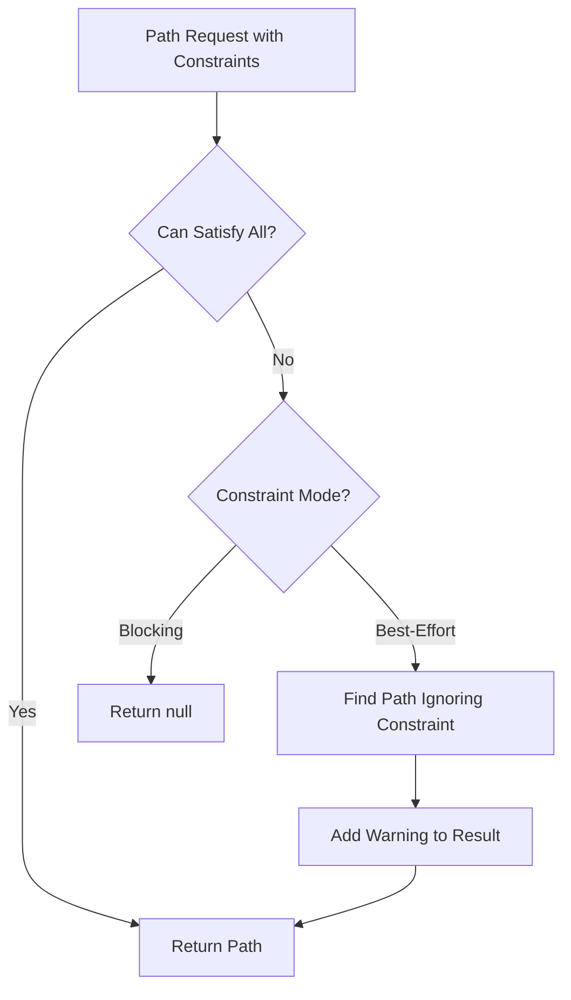

| Mode | Behavior | Use Case |
|------|----------|----------|
| **Blocking** | Returns `null` if constraint cannot be satisfied | Hard requirements (e.g., must avoid failed node) |
| **Best-Effort** | Returns path with warnings if constraint violated | Soft preferences (e.g., prefer to avoid congested link) |

### PathOptions Interface

```typescript
export interface PathOptions {
  weightAttribute?: 'distance' | 'weight' | 'cost';
  excludeEdges?: string[];
  excludeNodes?: string[];
  maxHops?: number;
  // Constraint modes
  excludeEdgesMode?: ConstraintMode;
  excludeNodesMode?: ConstraintMode;
  maxHopsMode?: ConstraintMode;
}
```

### PathResult with Warnings

```typescript
export interface PathResult {
  path: string[];        // Node IDs in order
  edges: string[];       // Edge IDs in order
  totalWeight: number;
  totalDistance: number;
  hopCount: number;
  warnings?: PathWarning[];  // Present if best-effort constraints violated
}

export interface PathWarning {
  type: 'node_not_avoided' | 'edge_not_avoided' | 'max_hops_exceeded';
  message: string;
  details?: {
    nodeId?: string;
    edgeId?: string;
    actualHops?: number;
    requestedMaxHops?: number;
  };
}
```

### Usage Examples

```typescript
// Blocking mode - fails if B must be in path
const result = pathFinder.shortestPath('A', 'Z', {
  excludeNodes: ['B'],
  excludeNodesMode: 'blocking'
});
// Returns null if B is required

// Best-effort mode - returns path with warning
const result = pathFinder.shortestPath('A', 'Z', {
  excludeNodes: ['B'],
  excludeNodesMode: 'best-effort'
});
// Returns path even if B is included, with warning

// Combined constraints
const result = pathFinder.shortestPath('A', 'Z', {
  excludeNodes: ['B', 'C'],
  excludeNodesMode: 'best-effort',
  maxHops: 3,
  maxHopsMode: 'blocking',  // Hard limit on hops
  weightAttribute: 'cost'
});
```

### Algorithm Tester UI

The AlgorithmTester component provides a collapsible constraint panel:

- **Avoid Nodes** - Checkbox list of nodes (excludes source/target)
- **Avoid Edges** - Checkbox list of edges
- **Max Hops** - Number input with mode toggle
- **Weight Attribute** - Dropdown for distance/weight/cost

Results display warnings when best-effort constraints are violated.

---

## Algorithm Benchmarking

The Algorithm Tester component (`src/components/debug/AlgorithmTester.tsx`) provides built-in performance measurement for all graph algorithms.

### Timing Utilities

```typescript
// Generic timing wrapper
interface TimedResult<T> {
  result: T;
  elapsedMs: number;
}

function withTiming<T>(fn: () => T): TimedResult<T> {
  const start = performance.now();
  const result = fn();
  const elapsedMs = performance.now() - start;
  return { result, elapsedMs };
}
```

### Timing Display Format

The `formatTimingLine()` function formats elapsed time appropriately:

| Elapsed Time | Display Format |
|-------------|----------------|
| >= 1 ms | `29.456 ms` |
| >= 1 µs | `456.7 µs` |
| < 1 µs | `<1 µs` |

### High-Precision Timing

By default, browsers limit `performance.now()` precision for security (Spectre/Meltdown mitigations):

| Browser | Default Precision | With Cross-Origin Isolation |
|---------|------------------|----------------------------|
| Chrome | 100 µs + jitter | 5 µs |
| Firefox | 2 ms (rounded) | 20 µs |
| Safari | 1 ms | N/A |

The dev server enables high-precision timing via HTTP headers in `vite.config.ts`:

```typescript
server: {
  headers: {
    'Cross-Origin-Opener-Policy': 'same-origin',
    'Cross-Origin-Embedder-Policy': 'require-corp',
  },
}
```

Check if high-precision timing is active:
```typescript
const isHighPrecision = window.crossOriginIsolated; // true = enabled
```

### Stress-Test Topologies

The Algorithm Tester includes large topologies for performance testing:

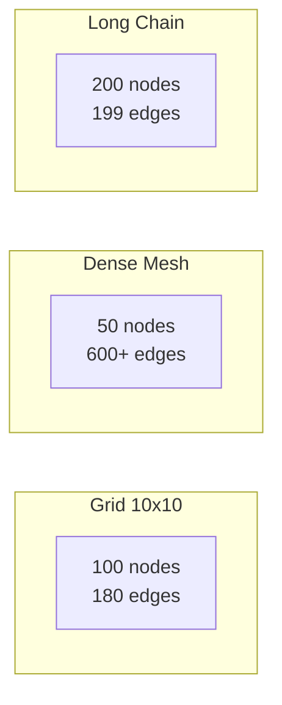

| Topology | Nodes | Edges | Use Case |
|----------|-------|-------|----------|
| Grid 10x10 | 100 | 180 | Grid routing stress test |
| Dense Mesh | 50 | 600+ | High-connectivity stress test |
| Long Chain | 200 | 199 | Sequential path stress test |

---

## Component Architecture

### Layout Components (`src/components/layout/`)

- **Header** - Application title, global actions
- **Sidebar** - Node palette, event log, tools
- **StatusBar** - Selection info, zoom level, connection status

### Topology Components (`src/components/topology/`)

- **Canvas** - React Flow wrapper, handles interactions
- **NetworkNode** - Custom node renderer with type icons
- **NetworkEdge** - Custom edge renderer
- **NodeInspector** - Property panel for selected node
- **EdgeInspector** - Property panel for selected edge
- **Toolbar** - Tool mode buttons, undo/redo
- **ExportModal** - Download topology as JSON file
- **ImportModal** - Upload and validate topology JSON file
- **AddNodeModal** - Node type selection and creation

### UI Primitives (`src/components/ui/`)

Following shadcn/ui patterns with Radix UI:

- Button, Input, Select, Dialog, Dropdown, Checkbox
- ModalTemplate - Reusable modal layout with sections and grids
- Use `cn()` utility for className merging
- Use `cva()` for variant definitions

---

## UX Enhancements

### Tool Mode Cursors

The canvas displays context-appropriate cursors based on the active tool mode. Implemented via CSS attribute selectors in `src/styles/globals.css`:

```css
[data-tool-mode="select"] .react-flow__pane { cursor: default; }
[data-tool-mode="add"] .react-flow__pane    { cursor: crosshair; }
[data-tool-mode="connect"] .react-flow__pane { cursor: crosshair; }
[data-tool-mode="pan"] .react-flow__pane     { cursor: grab; }
[data-tool-mode="pan"] .react-flow__pane:active { cursor: grabbing; }
```

The `data-tool-mode` attribute is set on the canvas wrapper in `Canvas.tsx`.

### Middle-Click Panning

Middle mouse button (scroll wheel click) always enables panning regardless of the current tool mode:

```typescript
panOnDrag={toolMode === 'pan' ? true : [1]} // [1] = middle button only
```

### Click-to-Deselect

Clicking on empty canvas space deselects all nodes/edges and closes the inspector:

```typescript
const onPaneClick = useCallback((event: React.MouseEvent) => {
  if (toolMode === 'add') {
    // ... add node logic
  } else {
    clearSelection();
    closeInspector();
  }
}, [toolMode, clearSelection, closeInspector]);
```

### Dialog Animations

Modal dialogs use a bounce-in animation for visual polish:

```typescript
// tailwind.config.js
keyframes: {
  bounceIn: {
    '0%': { transform: 'scale(0.9)', opacity: '0' },
    '50%': { transform: 'scale(1.02)' },
    '100%': { transform: 'scale(1)', opacity: '1' },
  },
}
```

Applied via `data-[state=open]:animate-bounce-in` on DialogContent.

### AddNodeModal Responsive Design

The Add Node modal uses responsive grid layouts:

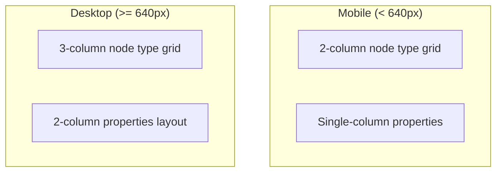

Node type buttons animate in with staggered delays for visual polish:

```css
.node-type-btn:nth-child(1) { animation-delay: 0ms; }
.node-type-btn:nth-child(2) { animation-delay: 40ms; }
/* ... up to 6 buttons */
```

---

## Code Quality

### ESLint Configuration

The project uses ESLint with multiple plugins for comprehensive code quality enforcement.

**Configuration file:** `.eslintrc.cjs`

**Plugins:**
- `@typescript-eslint/eslint-plugin` - TypeScript-aware linting
- `eslint-plugin-react` - React best practices
- `eslint-plugin-react-hooks` - Rules of hooks enforcement
- `eslint-plugin-react-refresh` - Fast refresh compatibility checks
- `eslint-plugin-tailwindcss` - Tailwind CSS classname validation

**Key Rules:**
```javascript
{
  '@typescript-eslint/no-unused-vars': 'warn',
  '@typescript-eslint/no-explicit-any': 'warn',
  'react/react-in-jsx-scope': 'off',        // React 18 auto-imports
  'react-hooks/rules-of-hooks': 'error',
  'react-hooks/exhaustive-deps': 'warn',
  'tailwindcss/classnames-order': 'warn',
}
```

**Scripts:**
```bash
npm run lint          # Check for issues (warnings allowed)
npm run lint:strict   # Check with zero warnings allowed
npm run lint -- --fix # Auto-fix fixable issues
```

**Ignored Paths:** (`.eslintignore`)
- `dist/` - Build output
- `node_modules/` - Dependencies
- `coverage/` - Test coverage reports
- `*.config.js`, `*.config.ts` - Configuration files

---

## Testing Strategy

### Unit Tests (`src/**/__tests__/`)

Run with Vitest:

```bash
npm run test        # Watch mode
npm run test:run    # Single run
```

**Coverage:**
- `networkStore.test.ts` - Store operations, undo/redo
- `uiStore.test.ts` - UI state transitions
- `GraphEngine.test.ts` - Validation, connectivity
- `PathFinder.test.ts` - Path algorithms

### E2E Tests (`e2e/`)

Run with Puppeteer:

```bash
npm run test:e2e
```

**Workflow tests:**
- Page load and initial state
- Node creation (drag-drop, double-click)
- Edge creation
- Selection and deletion
- Undo/redo
- Toolbar interactions

### Docker Testing

```bash
docker-compose --profile test run --rm test    # Unit tests
docker-compose --profile e2e run --rm e2e      # E2E tests
```

---

## Export/Import System

The application provides full topology portability via JSON export and import.

### Export Modal (`ExportModal.tsx`)

Downloads the current topology as a JSON file:

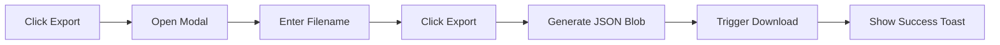

**Features:**
- Custom filename with automatic `.json` extension
- Preview shows topology name, node/edge counts, last modified date
- Warning displayed for empty topologies
- Success/error toast notifications

### Import Modal (`ImportModal.tsx`)

Loads a topology from a JSON file with validation:

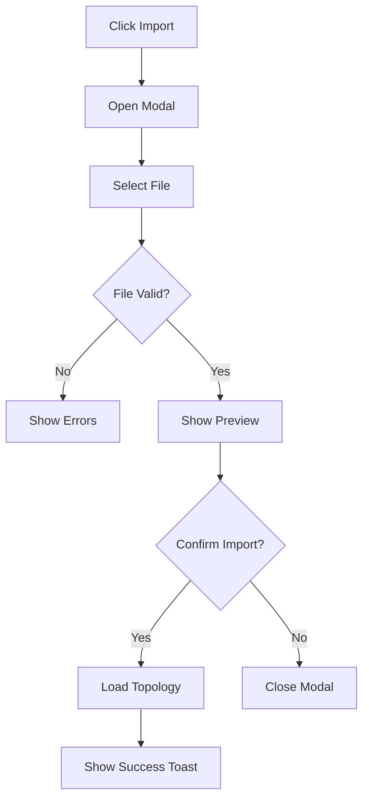

**Validation Checks:**
- File size limit: 10MB
- File extension: `.json` only
- JSON parse validation
- Required fields: `nodes` array, `edges` array
- Node structure: `id`, `type`, `position`
- Edge structure: `id`, `source`, `target`

**Error Display:**
- Shows up to 5 validation errors
- Indicates total error count if more exist
- Red border styling for invalid files

### JSON Schema

```typescript
interface ExportedTopology {
  id: string;
  name: string;
  version: string;
  metadata: {
    created: string;   // ISO timestamp
    modified: string;  // ISO timestamp
  };
  nodes: NetworkNode[];
  edges: NetworkEdge[];
}
```

---

## Data Persistence

The application uses automatic persistence with visual feedback.

### Auto-Save Behavior

All topology changes are automatically persisted to IndexedDB (with localStorage fallback) via Zustand's persist middleware:

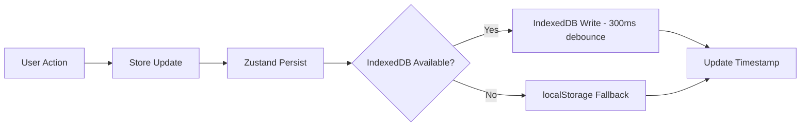

**Persistence is automatic:**
- No manual save button required
- Writes are debounced at 300ms to coalesce rapid mutations
- Monotonic version counter rejects stale writes
- Undo/redo history is excluded from persistence (session-only)
- Works offline

### Debounced Writes (Sprint 5)

The IndexedDB storage adapter debounces `setItem` calls at 300ms:
- Rapid state changes within a 300ms window coalesce into a single IndexedDB write
- A monotonic version counter per store key detects stale writes (older version skipped)
- On write failure, the adapter falls back to localStorage and emits an `indexeddb-write-error` custom event
- Persist writes can be suppressed during bulk loading via `suppressPersist()` / `resumePersist()`

### History Exclusion

The `networkStore` uses `partialize` to exclude undo/redo history from persistence:

```typescript
partialize: (state) => ({ topology: state.topology })
```

This means `past`, `future`, and `historyIndex` are session-only. On page reload, a fresh keyframe is seeded from the loaded topology via `initializeHistory()`.

### IDB Singleton

All IndexedDB access goes through a shared store instance from `src/lib/idb-store-singleton.ts`:

```typescript
import { createStore } from 'idb-keyval';
export const atlasStore = typeof indexedDB !== 'undefined'
  ? createStore('atlas-network-db', 'zustand-persist')
  : undefined;
```

Both `indexeddb-storage.ts` and `storage-migration.ts` import this singleton, preventing dual database connections that can interfere with each other's transactions.

### Storage Health Indicator

The `StatusBar` displays the current storage backend:
- **IndexedDB**: Subtle database icon with "IndexedDB" label
- **localStorage fallback**: Warning-colored icon with "localStorage" label
- Updates on `indexeddb-write-error` events (auto-detects fallback)

### Saved Status Indicator

The header displays a simple "Saved" indicator with timestamp:

```
✓ Saved (just now)
✓ Saved (5m ago)
✓ Saved (2h ago)
✓ Saved (Jan 15, 2024)
```

**Timestamp formatting:**
- `just now` - Less than 60 seconds ago
- `Xm ago` - Less than 60 minutes ago
- `Xh ago` - Less than 24 hours ago
- Date string - More than 24 hours ago

### Backup Strategy

While auto-save handles browser persistence, users should use Export for backups:

| Scenario | Solution |
|----------|----------|
| Browser data cleared | Restore from exported JSON |
| Share with colleagues | Export and send file |
| Version control | Export and commit to git |
| Multiple machines | Export/Import between browsers |

### Storage Keys

| Store | Storage Key | Data Stored |
|-------|-------------|-------------|
| networkStore | `network-topology-storage` | Topology only (nodes, edges, metadata) — history excluded |
| serviceStore | `service-store` | All services and selection state |
| settingsStore | `settings-store` | Application settings |
| eventStore | `event-store` | Event log history |

---

## Deployment

The application can be deployed to Google Cloud Run using the included CI/CD pipeline and Docker configuration.

### Cloud Run Deployment

See [DEPLOYMENT-CLOUD-RUN.md](./DEPLOYMENT-CLOUD-RUN.md) for detailed instructions including:

- **Quick Start CLI** - Deploy in under 5 minutes with `gcloud run deploy`
- **Manual Deployment** - Step-by-step Artifact Registry and Cloud Run setup
- **Console UI** - Deploy via Google Cloud Console web interface
- **CI/CD Pipeline** - Automated GitHub Actions workflow

### Docker Files

| File | Purpose |
|------|---------|
| `Dockerfile.cloudrun` | Optimized multi-stage build for Cloud Run |
| `nginx.cloudrun.conf` | Nginx configuration with dynamic PORT support |
| `.github/workflows/deploy-cloudrun.yml` | CI/CD pipeline (test, build, deploy, smoke-test) |

### Key Configuration

Cloud Run requires dynamic port configuration:

```dockerfile
# Nginx listens on PORT environment variable (default: 8080)
ENV PORT=8080
CMD ["sh", "-c", "envsubst '${PORT}' < /etc/nginx/templates/default.conf.template > /etc/nginx/conf.d/default.conf && nginx -g 'daemon off;'"]
```

### Health Check

The deployed application provides a health endpoint at `/health` for monitoring and load balancer probes

---

## Capacity Planning

The capacity planning system provides tools for monitoring network utilization, performing what-if analysis, studying lambda availability, and defragmenting optical spectrum.

### CapacityTracker (`src/core/services/CapacityTracker.ts`)

Central engine for capacity metrics and analysis.

**Key API:**

```typescript
class CapacityTracker {
  getEdgeUtilization(edgeId: string): EdgeUtilization;
  getNodeUtilization(nodeId: string): NodeUtilization;
  getLambdaMap(edgeId: string): LambdaMap;           // 96-channel allocation map
  getBottleneckEdges(threshold?: number): string[];   // Edges above utilization threshold
  simulateServiceAddition(config): WhatIfResult;      // What-if: add service
  simulateServiceAdditionWithPath(config): WhatIfResult; // With pre-computed path
  simulateServiceRemoval(serviceId): WhatIfResult;    // What-if: remove service
}
```

### What-If Analysis

**WhatIfPathComputer** (`src/core/services/WhatIfPathComputer.ts`):

```typescript
class WhatIfPathComputer {
  computePath(source, target, options): ComputedPath;
  computeBatchPaths(batch): ComputedPath[];           // Batch with VirtualCapacityState
  validateModulationReach(path, modulation): boolean;  // Feasibility check
}
```

**Features:**
- PathFinder integration with node-type filtering (DWDM edges only for L1)
- `VirtualCapacityState` for cumulative batch simulation without modifying real state
- Modulation reach validation (DP-QPSK: 2500km, DP-64QAM: 120km)
- Channel selection for L1 DWDM services
- Session-only history (last 10 analyses) with recall

**UI Components:**
- `WhatIfConfig` — Action radio cards (Add/Remove/Modify), service form, batch list
- `ComputedPathPanel` — Path details (hops, distance, feasibility)
- `WhatIfResults` — Vertical bar pair visualization with narrative summary
- `WhatIfHistory` — DropdownMenu recall of recent analyses

### Lambda Availability

**LambdaAnalyzer** (`src/core/services/LambdaAnalyzer.ts`):

```typescript
class LambdaAnalyzer {
  analyzePath(path: string[]): PathLambdaAnalysis;
  analyzeWithRegeneration(path: string[]): PathLambdaAnalysis;  // Router/terminal regen, 15-edge cap
}

interface PathLambdaAnalysis {
  path: string[];
  edges: EdgeLambdaInfo[];       // Per-edge free/total counts
  commonFreeChannels: number[];  // Channels free on ALL edges (E2E)
  totalFreeE2E: number;
  bottleneckEdge: string;
  regenerationPoints?: string[]; // Nodes where regen is possible
}
```

**UI Components:**
- `LambdaAvailabilityStudy` — Source/target selection, k-path computation
- `PathCard` — Path card with "Best" badge, stats, `PathSequence`
- `PathSpectrumView` — Per-edge `SpectrumGrid` rows + E2E common row + color-coded free counts

### Defragmentation

**DefragmentationEngine** (`src/core/services/DefragmentationEngine.ts`):

```typescript
class DefragmentationEngine {
  analyzeFragmentation(edgeId: string): FragmentationAnalysis;
  computeDefragMoves(edgeId, strategy): DefragMove[];
  assessRisk(moves: DefragMove[]): RiskAssessment;
  simulateDefrag(edgeId, moves): SimulationResult;  // Cloned lambda map
}
```

**Strategies:**
- `compact` — Pack all channels to lowest slots
- `minimal_moves` — Greedy gap-fill algorithm (fewest moves)
- `balance` — Distribute channels evenly across spectrum

**Risk Assessment:**
- `estimatedDowntime` per move
- Risk levels: `low` | `medium` | `high`
- Health categories: Critical (>80% fragmented), Warning (50-80%), Healthy (<30%), Recoverable

**Dashboard Metrics:**
- `FragmentationGauge` — 180-degree SVG arc with animated needle (unique gradient IDs)
- Largest contiguous block and fragment count columns
- Spectrum heatmap visualization

**5-Step Wizard:**
1. **Select** — Edge selection with validation
2. **Strategy** — Strategy selection (auto-skip for single edge)
3. **Review** — Move list with risk badges
4. **Simulate** — Before/after spectrum comparison
5. **Export/Apply** — Export moves + Apply with two-phase commit (validate → snapshot → apply → verify → undo)

---

## Simulation

The simulation system models fiber cut and node failure scenarios to analyze service survivability.

### FailureSimulator (`src/core/simulation/FailureSimulator.ts`)

Simulates single or multi-element failure scenarios.

```typescript
class FailureSimulator {
  simulate(config: FailureConfig): SimulationResult;
}

interface FailureConfig {
  failedEdgeIds: string[];
  failedNodeIds: string[];
}

interface SimulationResult {
  impacts: ServiceImpact[];
  survivabilityScore: number;     // 0-100
  totalBandwidthAffected: number; // Gbps
}

interface ServiceImpact {
  serviceId: string;
  status: 'survived' | 'down' | 'degraded' | 'at-risk';
  workingPathAffected: boolean;
  protectionPathAffected: boolean;
  failedEdges: string[];
}
```

**Service Impact Statuses:**
- `survived` — No paths affected, or working failed but protection switchover succeeded
- `temporary-outage` — Service disrupted but will be restored via WSON (~5 min)
- `degraded` — Working path failed, protection path active (partial capacity)
- `at-risk` — Protection path failed, working path still active (no redundancy)
- `down` — All paths failed, service is completely down

**Survivability Scoring with WSON Weighting:**
- `survived`, `degraded`, `at-risk`: weight = 1.0 (full credit)
- `temporary-outage`: weight = 0.8 (80% credit for delayed restoration)
- `down`: weight = 0.0
- Formula: `score = sum(weights) / affectedCount * 100`

### WSON Restoration Model

WSON (Wavelength Switched Optical Network) restoration provides dynamic path computation after failure. It is modeled as a **classification** (not a real-time simulation) with a fixed 5-minute restoration timer.

**Protection Schemes Supporting WSON:**

| Scheme | Description | Behavior on Failure |
|--------|-------------|---------------------|
| `wson-restoration` | Pure WSON, no pre-provisioned protection | Working fails -> `temporary-outage` (5 min) |
| `1+1+wson` | OLP 1+1 with WSON as tertiary backup | Working fails -> instant switchover; Both fail -> WSON (5 min) |

**1+1+WSON Five-Case Failure Classification:**

| Working | Protection | Restoration | Result | Description |
|---------|------------|-------------|--------|-------------|
| OK | OK | - | `survived` | No impact |
| Failed | OK | - | `survived` | Instant 1+1 OLP switchover |
| OK | Failed | - | `at-risk` | Working OK but no backup |
| Failed | Failed | OK/Dynamic | `temporary-outage` | WSON restores in ~5 min |
| Failed | Failed | Failed | `down` | All three paths exhausted |

**Simulation Modes (conceptual):**
- **Instantaneous**: What is the service status right after failure? (captured by `survived`/`down`/`at-risk`)
- **Steady-state**: What is the service status after restoration completes? (captured by `temporary-outage` -> restored)
- **Transient**: The 5-minute gap between failure and WSON restoration

**When to Use WSON vs 1+1 Only:**
- Use **1+1 (OLP)** when instant switchover is critical (real-time services, financial data)
- Use **WSON-restoration** when 5-minute outage is acceptable (batch data, non-critical services)
- Use **1+1+WSON** for maximum resilience: instant switchover for single failures, WSON backup for dual failures

### UI Components

| Component | Purpose |
|-----------|---------|
| SimulationPanel | Edge/node selection with search, SRLG badges, Quick Test, SRLG grouping |
| ScenarioBar | Failure description with "Link Down" badges |
| BandwidthImpact | CSS stacked bar + 6-metric summary (Total/Affected/Survived/Disrupted/At Risk/Lost) with amber WSON segment |
| ImpactReport | Service table with working+protection path columns, SRLG expandable sub-rows, amber "Restored (5 min)" badge |
| TopologySnapshot | SVG-based topology visualization with failed elements highlighted in red |
| ScenarioDetailModal | On-demand full simulation report for exhaustive scenario rows with temp outage support |

### ExhaustiveSimulator (`src/core/simulation/ExhaustiveSimulator.ts`)

Generates combinatorial failure scenarios for comprehensive analysis.

```typescript
// Constants
const MAX_SCENARIOS = 50_000;     // Hard cap on scenario count
const MAX_EDGE_FAILURES = 3;
const MAX_NODE_FAILURES = 2;

// Helper functions
estimateScenarioCount(config, edgeCount, nodeCount): number;
generateScenarios(config, edges, nodes): FailureScenario[];
```

**ExhaustiveConfig:**
```typescript
interface ExhaustiveConfig {
  maxEdgeFailures: number;    // 0-3
  maxNodeFailures: number;    // 0-2
}
```

**ExhaustiveResults:**
```typescript
interface ExhaustiveResults {
  scenarios: ExhaustiveScenarioSummary[];
  config: ExhaustiveConfig;
  completedAt: string;
  durationMs: number;
  bestScore: number;          // Highest survivability
  worstScore: number;         // Lowest survivability
  avgScore: number;           // Average survivability
}
```

### ExhaustiveRunner (`src/core/simulation/ExhaustiveRunner.ts`)

Async execution engine with progress reporting.

- Async iterator with `requestIdleCallback` batching for non-blocking UI
- Progress callbacks: `onProgress(completed, total)`
- `AbortController` support for cancellation
- Results stored in `simulationStore` (in-memory only, no persist)

### simulationStore (`src/stores/simulationStore.ts`)

- `exhaustiveConfig`, `exhaustiveProgress`, `exhaustiveResults`, `isExhaustiveRunning`
- NO `persist` middleware — results stay in-memory only (intentional for large datasets)
- Actions: `setExhaustiveConfig()`, `setExhaustiveProgress()`, `setExhaustiveResults()`, `clearExhaustive()`

---

## Network Reports

The reports system provides configurable report generation with export capabilities.

### Types (`src/types/reports.ts`)

```typescript
type ReportStatus = 'draft' | 'generating' | 'complete' | 'error';
type ReportCategory = 'network' | 'capacity' | 'simulation' | 'service';
type ReportPhase = 'configure' | 'running' | 'results';
type ExportFormat = 'pdf' | 'csv' | 'json';
```

### Report Library

8 report cards displayed in a searchable/filterable grid:
- **Network Summary** — Available (composite health score, topology stats, service summary)
- 7 "coming soon" placeholders (Capacity Analysis, Simulation Results, Service Inventory, etc.)
- Route: `/reports/:reportId`

### Components

| Component | Purpose |
|-----------|---------|
| ReportShell | Configure → Running → Results workflow with phase transitions |
| ReportExportBar | PDF/CSV/JSON export buttons with `@media print` CSS |
| NetworkSummaryReport | Network health score, topology stats, service summary |

### Workflow

1. **Configure** — Set report parameters (date range, scope, etc.)
2. **Running** — Progress indicator while report generates
3. **Results** — View report with export options (PDF, CSV, JSON)

---

## CSV Utilities

**File:** `src/lib/csv-utils.ts`

Shared utilities for building and downloading CSV files with security protections.

### API

```typescript
sanitizeCsvValue(value: string): string;     // Prefix dangerous chars with '
escapeCsvCell(value: string): string;         // Quote and escape for CSV
toCsvRow(cells: string[]): string;            // Join cells into CSV row
buildCsv(headers: string[], rows: string[][]): string;  // Build complete CSV
downloadCsv(csv: string, filename: string): void;       // Trigger download
```

### Security

Prevents formula injection in spreadsheets by sanitizing dangerous leading characters:
- `=`, `+`, `-`, `@`, tab (`\t`), carriage return (`\r`)
- Prefixes with single quote (`'`) which is hidden by most spreadsheet applications
- Covered by 27 unit tests (`src/lib/__tests__/csv-utils.test.ts`)

---

## OSNR Engine

**Files:** `src/core/optical/OSNREngine.ts`, `src/core/optical/types.ts`, `src/core/optical/constants.ts`

The OSNR (Optical Signal-to-Noise Ratio) engine provides span-by-span optical link budget calculations for DWDM paths.

### Architecture

The engine is composed of four calculation layers:

1. **SpanCalculator** - Fiber loss computation
2. **AmplifierModel** - ASE noise per ITU-T / Desurvire formulas
3. **NLICalculator** - Nonlinear interference via simplified GN model
4. **OSNREngine** - Cascaded GSNR with TX OSNR and EoL margin

### API

```typescript
// Core OSNR calculation
calculateOSNR(
  spans: SpanInput[],
  transceiver: TransceiverParams,
  amplifiers?: AmplifierParams[],
  eolMargin?: number,      // default: 3.0 dB
  includeNLI?: boolean,    // default: true
  numChannels?: number     // default: 80
): OSNRResult;

// Amplifier suggestion
suggestAmplifiers(
  spans: SpanInput[],
  transceiver: TransceiverParams,
  existingAmplifiers?: AmplifierParams[],
  eolMargin?: number,
  edgeIds?: string[]
): AmplifierSuggestion[];

// Quick feasibility check (simplified formula)
quickFeasibilityCheck(
  totalDistance: number,
  spanLength: number,
  launchPower_dBm: number,
  noiseFigure_dB: number,
  requiredOSNR_dB: number,
  margin_dB?: number
): boolean;
```

### Calculation Flow

1. For each span, compute fiber loss: `attenuation * distance + connectors + splices`
2. Apply amplifier at span output (explicit or auto-inserted): compute ASE noise OSNR contribution
3. Optionally compute NLI noise per span using simplified GN model (SPM + XPM scaling)
4. Cascaded OSNR via reciprocal addition: `1/OSNR_total = sum(1/OSNR_i)`
5. Include TX OSNR: `1/GSNR = 1/txOSNR + 1/OSNR_cascaded`
6. Feasibility: `margin = GSNR - requiredOSNR - eolMargin >= 0`

### Amplifier Suggestion Algorithm

When a path is infeasible, the greedy suggestion algorithm:
1. Finds spans without explicit amplifiers, ranked by span loss (worst first)
2. For each span, simulates adding an EDFA with gain equal to span loss
3. Calculates the OSNR improvement from the new amplifier
4. Returns suggestions sorted by improvement, filtered to those with > 0.1 dB benefit

### Auto-Inserted Amplifiers

When no explicit amplifier is provided between spans, the engine auto-inserts an EDFA with:
- Gain = span loss (full loss compensation)
- Noise figure = default (5.5 dB)
- A warning is added to the result

### EoL Margin

The End-of-Life (EoL) margin accounts for fiber aging, connector degradation, and environmental factors. Default: 3.0 dB. Configurable per-analysis and via Settings > Optical.

### Integration Points

- `L1ServiceManager.createL1Service()` calls OSNR engine after path computation
- `ServiceWizardPath.tsx` displays `OsnrAnalysisPanel` with link budget table
- `ServiceWizardReview.tsx` shows OSNR margin in the review step
- `OsnrSuggestionBanner.tsx` displays amplifier placement recommendations

### Reference Data

Test scenarios in `src/core/optical/__tests__/osnr-reference-data.json` cover:
- Single span, multi-span, and long-haul paths
- Various fiber types (G.652.D, G.654.E)
- With and without NLI
- Validation within 0.5 dB tolerance

---

## Transceiver Library

**Files:** `src/types/transceiver.ts`

### TransceiverType Interface

```typescript
type TransceiverFormFactor = 'CFP' | 'CFP2' | 'QSFP28' | 'QSFP-DD' | 'OSFP' | 'SFP+' | 'SFP28';

interface TransceiverModulationSupport {
  modulation: ModulationType;
  requiredOSNR: number;  // dB
  maxReach: number;      // km
}

interface TransceiverType {
  id: string;
  name: string;
  formFactor: TransceiverFormFactor;
  vendor: string;
  launchPower: number;         // dBm
  receiverSensitivity: number; // dBm
  txOSNR: number;              // dB
  supportedModulations: TransceiverModulationSupport[];
  supportedDataRates: L1DataRate[];
  baudRate: number;            // GBaud
}
```

### Default Library

| ID | Name | Form Factor | Data Rate | Baud Rate |
|----|------|-------------|-----------|-----------|
| `cfp2-dco-100g` | CFP2-DCO-100G | CFP2 | 100G | 32 GBd |
| `qsfp-dd-zrp-400g` | QSFP-DD-ZR+-400G | QSFP-DD | 400G | 64 GBd |
| `sfp-plus-10g-lr` | SFP+-10G-LR | SFP+ | 10G | 10.3 GBd |
| `sfp28-25g-lr` | SFP28-25G-LR | SFP28 | 25G | 25.78 GBd |
| `qsfp28-100g-zr` | QSFP28-100G-ZR | QSFP28 | 100G | 32 GBd |
| `qsfp-dd-200g-zr` | QSFP-DD-200G-ZR | QSFP-DD | 200G | 32 GBd |
| `osfp-400g-zr` | OSFP-400G-ZR | OSFP | 400G | 64 GBd |

### Wizard Integration

In `ServiceWizardParameters.tsx`, the transceiver dropdown:
1. Filters transceivers by selected data rate and modulation format
2. Auto-fills OSNR parameters (launch power, required OSNR, baud rate)
3. Stores `transceiverTypeId` on the created `L1DWDMService`
4. Merges `DEFAULT_TRANSCEIVERS` with user's custom library from settings

---

## Inventory System

**Files:** `src/types/inventory.ts`, `src/components/topology/InventoryTab.tsx`

### Overview

The inventory system provides card-based hardware management for network nodes. Nodes have a chassis with slots, and line cards can be installed to provision ports.

### Card Library

Default cards per node type:

| Card | Node Type | Ports | Capacity |
|------|-----------|-------|----------|
| IMM24-10G | Router | 24x 10G BW | 240 Gbps |
| IMM8-100G | Router | 8x 100G BW | 800 Gbps |
| WSS-C96 | OADM | 2x 96ch DWDM | - |
| ADD-DROP-16 | OADM | 2x 16ch DWDM | - |
| TRANSPONDER-2x100G | Terminal | 2x 100G DWDM | - |
| LINE-CARD-48x1G | Switch | 48x 1G BW | 48 Gbps |

### Store Actions

```typescript
// Install a card in a chassis slot — auto-creates Port objects from template
installCard(nodeId: string, cardDef: CardDefinition, slotNumber: number): void;

// Remove a card — validates no active services use its ports
removeCard(nodeId: string, cardId: string): void;

// Swap a card with a different definition
swapCard(nodeId: string, cardId: string, newCardDef: CardDefinition): void;
```

### UI: InventoryTab

Located at `src/components/topology/InventoryTab.tsx`, accessed via the NodeInspector pill-tab navigation (Properties | Inventory | Ports).

Features:
- Slot table: Slot # | Card Model | Ports | Status
- Empty slot: dashed placeholder with "+" button
- Add Card dialog: select from compatible cards (filtered by node type)
- Remove card: confirmation if ports have active services
- Data-testids: `inventory-tab`, `inventory-add-card-btn`

### Backward Compatibility

- Existing nodes without `installedCards` continue using their `ports[]` array unchanged
- `loadTopology()` migration handles nodes without inventory field (no-op)
- Inventory is optional enrichment, not required

---

## WSON Simulation

### Overview

WSON (Wavelength-Switched Optical Network) restoration provides a third layer of protection beyond 1+1 OLP. When both working and protection paths fail, the WSON control plane dynamically computes and provisions a restoration path.

### Service Impact Classification

| Status | Badge | Weight | Description |
|--------|-------|--------|-------------|
| `survived` | Green "Survived" | 1.0 | No impact |
| `down` | Red "Down" | 0.0 | Total failure |
| `degraded` | Yellow "Degraded" | 0.5 | Partial impact |
| `at-risk` | Orange "At Risk" | 0.7 | Protection path affected |
| `temporary-outage` | Amber "Restored (5 min)" | 0.8 | WSON restoration active |

### 1+1+WSON Protection Scheme

Five-case failure classification:

| Case | Working | Protection | WSON | Status |
|------|---------|------------|------|--------|
| 1 | OK | OK | - | survived |
| 2 | Affected | OK | - | survived (instant 1+1 switch) |
| 3 | OK | Affected | - | at-risk |
| 4 | Affected | Affected | Available | temporary-outage (5 min) |
| 5 | Affected | Affected | Unavailable | down |

### Simulation Modes

- **Instantaneous**: Assumes instant protection switching (1+1 OLP)
- **Steady-state**: Includes WSON restoration time (5 minutes)
- **Transient**: Models time-dependent behavior

### Configuration

- Simulation config checkbox: "Consider WSON restoration time (5 min)"
- Survivability scoring: `temporary-outage` weighted at 0.8 (between at-risk and survived)

### UI Integration

- `ImpactReport.tsx`: amber "Restored (5 min)" badge with clock icon
- `BandwidthImpact.tsx`: disrupted segment in stacked bar (amber)
- `ExhaustiveResults.tsx`: temp outage count column
- `ServiceWizardProtection.tsx`: "1+1+WSON Restoration" radio card option

### Regeneration Behavior

Regeneration in the Lambda Analyzer (`LambdaAnalyzer.ts`) is supported at router, terminal, and OADM nodes:
- `REGEN_CAPABLE_NODE_TYPES = ['router', 'terminal', 'oadm']`
- OADMs perform OEO (Optical-Electrical-Optical) regeneration, making them valid regen points
- Port availability check relaxed for planning mode: regen-capable nodes are identified regardless of port usage (port availability is advisory, not required)
- A "Regeneration Test" topology preset is available in DataGenerator for testing
- When enabled, regeneration can increase available lambda count by breaking wavelength continuity constraints at regen-capable nodes

---

## IndexedDB Storage

**Files:** `src/lib/idb-store-singleton.ts`, `src/lib/indexeddb-storage.ts`, `src/lib/storage-migration.ts`, `src/lib/cross-tab-sync.ts`

### Overview

Sprint 4 migrated persistent storage from localStorage to IndexedDB for:
- No 5MB size limit (IndexedDB allows 100s of MB)
- Better performance for large topologies
- Non-blocking async I/O

### IDB Singleton (Sprint 5)

All IndexedDB access uses a shared store instance from `src/lib/idb-store-singleton.ts`:

```typescript
import { createStore } from 'idb-keyval';
export const atlasStore = typeof indexedDB !== 'undefined'
  ? createStore('atlas-network-db', 'zustand-persist')
  : undefined;
```

Previously, `indexeddb-storage.ts` and `storage-migration.ts` each created their own `createStore()`, resulting in dual connections that could interfere with transactions. The singleton consolidates them.

### Storage Adapter

`createIndexedDBStorage()` returns a Zustand `StateStorage`-compatible adapter:

```typescript
const storage = createIndexedDBStorage();
// Use in Zustand persist config:
persist(storeCreator, {
  name: 'network-topology-storage',
  storage: createJSONStorage(() => storage),
});
```

### Debounced Writes (Sprint 5)

The `setItem` method is debounced at 300ms:
- Rapid state changes coalesce into a single IndexedDB write
- Monotonic version counter per key detects and rejects stale writes
- On write failure: emits `indexeddb-write-error` event, resets `indexedDBAvailable` flag, falls back to localStorage
- `suppressPersist()` / `resumePersist()` API for bulk operations

### Storage Backend Toggle

The debug `ResourceMonitor` provides a storage backend toggle:
- Radio buttons: "IndexedDB" / "localStorage"
- Stores preference in `localStorage.getItem('atlas-storage-backend')`
- On toggle: triggers page reload to reinitialize with new backend
- `isIndexedDBAvailable()` checks this preference before probing IndexedDB

### Storage Health UI

The `StatusBar` shows the active storage backend:
- `Database` icon + "IndexedDB" (normal)
- `HardDrive` icon + "localStorage" with warning color (fallback mode)
- Auto-updates on `indexeddb-write-error` events
- `data-testid="storage-backend-indicator"`

### Fallback

If IndexedDB is unavailable (private browsing, disabled, error, or user preference), the adapter transparently falls back to localStorage with the same API.

### Migration

`migrateLocalStorageToIndexedDB()` (called in `main.tsx` before store init):
1. Detects existing localStorage data for known store keys
2. Copies each value to IndexedDB (skips if IDB already has data)
3. Sets migration flag with session counter
4. Keeps localStorage data for 3 sessions as safety net
5. Clears localStorage copies after safety period

Store keys migrated: `network-topology-storage`, `service-store`, `settings-store`, `theme-storage`, `event-store`.

### Cross-Tab Sync (BroadcastChannel)

See the [Cross-Tab Synchronization](#cross-tab-synchronization) section for full details on the BroadcastChannel-based sync system, including Sprint 5 stability features (sender tab ID, rehydrating guard, debounce, suppress/resume API).

---

## Settings Dialog

**File:** `src/components/settings/SettingsDialog.tsx`

### Pending State Pattern

The settings dialog uses a pending state pattern to prevent accidental changes:

1. **On open**: `useState<AppSettings>` is initialized with a deep clone of the store settings
2. **User edits**: All section components modify the pending state, NOT the store
3. **Apply**: `importSettings(pending)` atomically commits all changes to the store
4. **Discard**: Pending state is re-cloned from the store (reverts all changes)
5. **Close without saving**: If changes exist, an unsaved changes confirmation dialog appears

### Change Detection

`detectChanges(current, pending)` compares all fields across sections:
- General: autoSave, distanceUnit, confirmDestructiveActions
- Canvas: gridVisible, gridSize, snapToGrid, defaultNodeType, showMinimap, defaultNodeNamePattern
- Network: defaultFiberProfile, defaultEdgeDistance, maxDWDMChannels, defaultVendor
- Simulation: defaultMaxEdgeFailures, defaultMaxNodeFailures
- Advanced: showDebugPanel, crossTabSync, historyLimit
- Optical: defaultEoLMargin, defaultLaunchPower, defaultNF, defaultConnectorLoss

Returns an array of `{ section, label, oldValue, newValue }` for the change summary panel.

### SectionProps Interface

All section components receive:
```typescript
interface SectionProps {
  pending: AppSettings;
  setPending: React.Dispatch<React.SetStateAction<AppSettings>>;
}
```

### Import into Pending

File import loads settings into the pending state (not directly into the store), with a toast: "Click Apply to save". This allows the user to review imported settings before committing.

### Data-testids

| testid | Purpose |
|--------|---------|
| `settings-apply-btn` | Apply button |
| `settings-discard-btn` | Discard button |
| `settings-changes-summary` | Change summary panel |
| `settings-unsaved-dialog` | Unsaved changes confirmation dialog |
| `settings-discard-confirm-btn` | Confirm discard button in dialog |

---

## Inventory Management (Settings)

**File:** `src/components/settings/InventorySection.tsx`

The Inventory tab in Settings provides full CRUD management for hardware libraries:

### Sub-Tabs
- **Transceivers** — Form factor, data rate, reach, modulation, OSNR threshold
- **Cards** — Node type, slot requirements, port config
- **Subtypes** — Node subtypes with default ports/capabilities

### Import/Export
- JSON import with security hardening: prototype pollution guard (`__proto__`, `constructor` stripped), 5MB file size limit, schema validation
- JSON export of current library state
- All changes go through pending state pattern (Apply/Discard)

### Data-testids
| testid | Purpose |
|--------|---------|
| `inventory-section` | Root container |
| `inventory-tab-transceivers` | Transceivers sub-tab |
| `inventory-tab-cards` | Cards sub-tab |
| `inventory-tab-subtypes` | Subtypes sub-tab |

---

## NCE Import Engine

**Directory:** `src/core/import/`

Pipeline for importing network topology from vendor NMS exports (CSV/JSON):

### Pipeline Stages
1. **CsvParser** — BOM detection, RFC 4180 parsing, `sanitizeCsvValue()` for XSS prevention
2. **ImportValidator** — Required field checks, coordinate range validation, row-level errors/warnings
3. **ImportTransformer** — Vendor NE type → ATLAS node type mapping (30+ Huawei types)
4. **ImportEngine** — Orchestrator: parse → validate → transform → UUID generation → reference resolution

### Template System
- `src/core/import/templates/huawei-nce.ts` — Column definitions, sample data, template download generator
- Extensible: add new templates by implementing `ImportTemplate` interface from `src/types/import.ts`

### Import Wizard UI
**File:** `src/components/import/ImportWizard.tsx`

5-step wizard: Upload → Map Columns → Validate → Preview → Import

---

## Capacity Forecasting

**Directory:** `src/core/forecast/`

Projects future network capacity needs using configurable growth models.

### Growth Models (`GrowthModels.ts`)
Pure math functions (no dependencies):
- **Linear regression** — Least squares fit, extrapolation
- **Compound growth (CAGR)** — Exponential projection with configurable rate
- **Logistic S-curve** — Saturation-aware growth with carrying capacity

### Forecasters
- **ServiceForecaster** — Total service count + per-type (L1 DWDM, L2 Ethernet, L3 IP) breakdown
- **NodeCapacityForecaster** — Port utilization projection, exhaustion date detection, upgrade recommendations
- **LambdaForecaster** — Per-edge channel usage, section-level exhaustion, E2E bottleneck detection

### ForecastEngine (`ForecastEngine.ts`)
Orchestrator accepting a `ForecastDataProvider` interface:
```typescript
interface ForecastDataProvider {
  getNodes: () => TopologyNode[];
  getEdges: () => TopologyEdge[];
  getServices: () => Service[];
}
```

### UI Components
- **ForecastPanel** (`src/components/forecast/ForecastPanel.tsx`) — Config sidebar + results area
- **ForecastConfig** — Type radio cards (Service/Node/Lambda), method dropdown, date pickers, growth rate
- **ForecastChart** — Lazy-loaded Recharts chart with confidence bands (separate 36KB chunk)
- **ForecastTable** — Period/historical/forecast/delta columns
- **ForecastPage** (`src/pages/ForecastPage.tsx`) — Route wrapper at `/forecast`

### Forecast Types (`src/types/forecast.ts`)
- `ForecastType`: `'service' | 'node' | 'lambda'`
- `ForecastMethod`: `'linear-regression' | 'compound-growth' | 'saturation'`
- `ForecastInterval`: `'monthly' | 'quarterly' | 'yearly'`

---

## App Improvements & Bug Fix Pack (Apr 2026)

### Full Network Net Change

The What-If panel summary metric `fullNetworkNetChange` is the **raw float average of per-edge utilization deltas computed across ALL edges in the topology**, not just the edges affected by the simulated batch.

```
fullNetworkNetChange = mean over edge ∈ allEdges of (utilAfter[edge] − utilBefore[edge])
```

- **Denominator** is the full network edge count (not the count of affected edges) — this is the canonical "net" reading and prevents inflated/negated readings when a batch touches a small subset of the topology.
- **Decimal precision for sub-1% values**: rendered via `formatPercentDelta()` in `src/lib/format-percent.ts`. When `|value| < 1` the display switches to decimal precision (e.g., `+0.13%`, `+0.001%`); when `|value| ≥ 1` an integer is shown. A true zero renders with a neutral marker (no leading sign) to differentiate from rounded-to-zero displays.
- **Cumulative batch simulation**: the per-edge `usedBefore`, `usedAfter`, `totalChannels`, and `channelDelta` fields on `WhatIfEdgeImpact` reflect the post-batch cumulative state in `WhatIfPathComputer` — they are not per-service deltas in isolation.

### Defragmentation Safety Ceiling

`DefragmentationEngine` now processes **all selected edges** up to a configurable safety ceiling.

- **Default cap**: 5,000 channel moves per wizard run.
- **Configurable**: surfaced in the wizard's Strategy step; the active cap is shown alongside the resulting plan.
- **Truncation banner**: when a plan would exceed the cap, the wizard discloses `processed-vs-target edge count` and renders a banner so users know they are acting on a partial plan.
- `DefragPlan` now exposes `processedEdgeIds: string[]`, `truncated: boolean`, `maxMoves: number` (see `contracts/defrag-plan.contract.md`). Prior behaviour silently truncated multi-edge plans at ~50 moves — **users who ran defrag on multi-edge selections before this release should re-run it.**

### Roadmap Toggle

"Coming Soon" stubs (7 placeholder reports, 4 vendor adapters, OLT/ONT in node palette) are now hidden behind a Settings toggle.

- **Location**: Settings → General → "Show roadmap (preview unfinished features)"
- **Default**: `OFF` in release builds; preserves discovery and stakeholder demos without forcing the unfinished features into the production surface.
- **Persistence**: `settingsStore` v3→v4 migration adds `general.showRoadmap = false` to existing user state.
